# Diaz's modulus conjecture — a formalized negative result

Let `ℒ = {u ∈ ℂ : eᵘ ∈ Q̄ˣ}`, the logarithms of algebraic numbers. Diaz
conjectured in 2004 that no non-zero element of `ℒ` has algebraic
modulus, and asked alongside it a question of method: how could the
non-holomorphic maps `z ↦ z̄` and `z ↦ |z|` enter a transcendence proof
at all?

This repository is the machine-checked part of an answer in the negative
direction.

## The observation

Suppose `u ≠ 0` has `eᵘ` and `|u|` both algebraic, and put `ρ = u ū`.
Then

```
ū = ρ / u
```

so the conjugate of a candidate is not independent data — it is a
rational function of `u` with algebraic coefficients. Hence `Q̄(u)` is a
rational function field carrying an involution, and complex conjugation
on it is determined by the ring structure rather than being extra
information that might fail to be matched. Consequently no statement
about vanishing of matrix coefficients over `Q̄ ⊕ Q̄u ⊕ Q̄ū` can tell a
candidate apart from an ordinary complex number placed on the same
circle.

An entire style of attack — accumulate algebraic constraints on `u` and
`ū` until they collide — cannot settle the conjecture.

No new transcendence result is claimed. These are negative results.

## Build

```bash
lake exe cache get && lake build Diaz
```

Lean 4.32.2, Mathlib v4.32.2.

## Dependency graph

Generated from the sources, not drawn by hand; the axiom colouring was
cross-checked against `#print axioms` and agrees. Amber is imported and
assumed, blue rests on an import, green is proved outright. Helper lemmas are omitted here for legibility; `dependency-graph.dot`
carries all 61, grouped by file. Both are transitively reduced: an edge
implied by a longer path is not drawn, so a declaration's full
dependency set is its ancestors, not just its parents.

Regenerate with `scripts/depgraph.py` after any change to the Lean;
nothing here is hand-maintained.

```mermaid
flowchart TD
  subgraph Axioms["Axioms.lean"]
    hermite_lindemann[["hermite_lindemann"]]
    exists_ringHom_of_transcendental[["exists_ringHom_of_transcendental"]]
  end
  subgraph Closure["Closure.lean"]
    hull("hull")
    transcendental_ne_zero("transcendental_ne_zero")
    ne_zero_of_notMem("ne_zero_of_notMem")
    conj_eq_rho_div("conj_eq_rho_div")
    conj_mem_hull("conj_mem_hull")
    conj_not_linear("conj_not_linear")
    conj_not_linear_hull("conj_not_linear_hull")
    eqOn_hull("eqOn_hull")
    transcendental_of_candidate("transcendental_of_candidate")
    transcendental_of_base("transcendental_of_base")
    transcendental_candidate_over_base("transcendental_candidate_over_base")
  end
  subgraph Model["Model.lean"]
    norm_form("norm_form")
    sq_add_sq_notMem("sq_add_sq_notMem")
    norm_mem_iff("norm_mem_iff")
    indep("indep")
    conj_coords("conj_coords")
    transcendental_exp_I("transcendental_exp_I")
    exists_transcendental_on_circle("exists_transcendental_on_circle")
    exists_transcendental_on_circle_sq("exists_transcendental_on_circle_sq")
  end
  subgraph Exponential["Exponential.lean"]
    isAlgebraic_two_rpow("isAlgebraic_two_rpow")
    Exp0("Exp0")
    Exp0_add("Exp0_add")
    Exp0_swap_conj("Exp0_swap_conj")
    Exp0_isAlgebraic("Exp0_isAlgebraic")
    Exp0_eq_one_iff("Exp0_eq_one_iff")
    Exp0_pow_eq_one_iff("Exp0_pow_eq_one_iff")
    model_falsifies("model_falsifies")
  end
  subgraph Transfer["Transfer.lean"]
    conj_comm("conj_comm")
    coeff_transfer("coeff_transfer")
    Hmat_transfer("Hmat_transfer")
    exists_conj_intertwining("exists_conj_intertwining")
  end
  subgraph Rigidity["Rigidity.lean"]
    Hmat("Hmat")
    det_Hmat("det_Hmat")
    no_vanishing_coeff("no_vanishing_coeff")
    coeff_eq_matrix("coeff_eq_matrix")
    no_vanishing_coeff_matrix("no_vanishing_coeff_matrix")
    candidate_no_vanishing_coeff("candidate_no_vanishing_coeff")
  end
  subgraph Instantiation["Instantiation.lean"]
    Qbar("Qbar")
    QbarIsAlgebraic("QbarIsAlgebraic")
    mem_Qbar_iff("mem_Qbar_iff")
    conj_mem_Qbar("conj_mem_Qbar")
    candidate_no_vanishing_coeff_Qbar("candidate_no_vanishing_coeff_Qbar")
    exists_transcendental_on_circle_Qbar("exists_transcendental_on_circle_Qbar")
    candidate_indistinguishable("candidate_indistinguishable")
  end
  subgraph Nodes["Nodes.lean"]
    not_on_axes("not_on_axes")
    plane_norm("plane_norm")
    indep_three("indep_three")
    four_nodes("four_nodes")
    sq_notMem_of_transcendental("sq_notMem_of_transcendental")
    four_nodes_candidate("four_nodes_candidate")
  end
  conj_eq_rho_div --> conj_mem_hull
  hull --> conj_not_linear_hull
  hull --> eqOn_hull
  hermite_lindemann --> transcendental_of_candidate
  transcendental_of_base --> transcendental_candidate_over_base
  transcendental_of_candidate --> transcendental_candidate_over_base
  norm_form --> norm_mem_iff
  sq_add_sq_notMem --> norm_mem_iff
  conj_eq_rho_div --> indep
  sq_add_sq_notMem --> indep
  transcendental_ne_zero --> indep
  transcendental_of_candidate --> transcendental_exp_I
  transcendental_exp_I --> exists_transcendental_on_circle
  transcendental_of_base --> exists_transcendental_on_circle
  exists_transcendental_on_circle --> exists_transcendental_on_circle_sq
  Exp0 --> Exp0_add
  Exp0 --> Exp0_isAlgebraic
  isAlgebraic_two_rpow --> Exp0_isAlgebraic
  Exp0 --> Exp0_eq_one_iff
  Exp0_eq_one_iff --> Exp0_pow_eq_one_iff
  Exp0_isAlgebraic --> model_falsifies
  conj_eq_rho_div --> conj_comm
  eqOn_hull --> conj_comm
  Hmat --> Hmat_transfer
  conj_comm --> Hmat_transfer
  conj_comm --> exists_conj_intertwining
  exists_ringHom_of_transcendental --> exists_conj_intertwining
  transcendental_ne_zero --> exists_conj_intertwining
  Hmat --> det_Hmat
  ne_zero_of_notMem --> no_vanishing_coeff
  Hmat --> coeff_eq_matrix
  coeff_eq_matrix --> no_vanishing_coeff_matrix
  no_vanishing_coeff --> no_vanishing_coeff_matrix
  no_vanishing_coeff_matrix --> candidate_no_vanishing_coeff
  transcendental_candidate_over_base --> candidate_no_vanishing_coeff
  Qbar --> QbarIsAlgebraic
  Qbar --> mem_Qbar_iff
  mem_Qbar_iff --> conj_mem_Qbar
  Qbar --> candidate_no_vanishing_coeff_Qbar
  candidate_no_vanishing_coeff --> candidate_no_vanishing_coeff_Qbar
  conj_mem_Qbar --> exists_transcendental_on_circle_Qbar
  exists_transcendental_on_circle --> exists_transcendental_on_circle_Qbar
  conj_mem_Qbar --> candidate_indistinguishable
  exists_conj_intertwining --> candidate_indistinguishable
  exists_transcendental_on_circle_sq --> candidate_indistinguishable
  transcendental_candidate_over_base --> candidate_indistinguishable
  conj_eq_rho_div --> indep_three
  transcendental_ne_zero --> indep_three
  plane_norm --> four_nodes
  four_nodes --> four_nodes_candidate
  not_on_axes --> four_nodes_candidate
  sq_notMem_of_transcendental --> four_nodes_candidate
  transcendental_candidate_over_base --> four_nodes_candidate
  classDef ax fill:#f5c26b,stroke:#b8860b,color:#000
  classDef onax fill:#bcd9f5,stroke:#3a6ea5,color:#000
  classDef proved fill:#c6e9c6,stroke:#3c8a3c,color:#000
  class hermite_lindemann,exists_ringHom_of_transcendental ax
  class transcendental_of_candidate,transcendental_candidate_over_base,transcendental_exp_I,exists_transcendental_on_circle,exists_transcendental_on_circle_sq,exists_conj_intertwining,candidate_no_vanishing_coeff,candidate_no_vanishing_coeff_Qbar,exists_transcendental_on_circle_Qbar,candidate_indistinguishable,four_nodes_candidate onax
  class hull,transcendental_ne_zero,ne_zero_of_notMem,conj_eq_rho_div,conj_mem_hull,conj_not_linear,conj_not_linear_hull,eqOn_hull,transcendental_of_base,norm_form,sq_add_sq_notMem,norm_mem_iff,indep,conj_coords,isAlgebraic_two_rpow,Exp0,Exp0_add,Exp0_swap_conj,Exp0_isAlgebraic,Exp0_eq_one_iff,Exp0_pow_eq_one_iff,model_falsifies,conj_comm,coeff_transfer,Hmat_transfer,Hmat,det_Hmat,no_vanishing_coeff,coeff_eq_matrix,no_vanishing_coeff_matrix,Qbar,QbarIsAlgebraic,mem_Qbar_iff,conj_mem_Qbar,not_on_axes,plane_norm,indep_three,four_nodes,sq_notMem_of_transcendental proved
```



The shape of it is the point. Almost everything is green: the closure
argument, the model, the matrix. The blue is confined to two thin chains
— transcendence of a candidate, and the existence of the isomorphism —
and each ends at an amber node that is a named classical theorem, not
anything near the frontier this note is about.

## What is proved

`Closure.lean`
- `conj_eq_rho_div` — `ρ / u = conj u`. Everything rests on this line.
- `conj_mem_hull` — the subfield generated by `K` and `u` is stable under
  conjugation.
- `conj_not_linear`, `conj_not_linear_hull` — conjugation is not linear
  over any base containing a non-real number, stated on `ℂ` and on the
  hull. The hull form is the one the refuted claim needs, since
  `∀ z ∈ hull` is the weaker universal and so has the stronger negation.
- `eqOn_hull` — two ring homomorphisms agreeing on `K` and at `u` agree
  on the whole hull.

`Model.lean`
- `norm_form` — `(a t + b t̄)(a t̄ + b t) = (a²+b²) t t̄ + a b (t² + t̄²)`.
- `sq_add_sq_notMem` — the cross term is not in `K`, else `t` satisfies
  `X⁴ − c X² + ρ²`.
- `norm_mem_iff` — the elements of the rational plane with algebraic
  modulus are exactly the rational multiples of `t` and of `t̄`.
- `indep` — `t` and `t̄` are `ℚ`-independent, so plane coordinates are
  well defined.
- `conj_coords` — conjugation acts on the plane by swapping coordinates,
  which is what licenses stating the involution in coordinates.
- `exists_transcendental_on_circle` — such a `t` exists, with the
  explicit witness `r·e^i`. The hypotheses of the model results are not
  merely satisfiable in the abstract.

`Exponential.lean`
- `isAlgebraic_two_rpow` — `2^q` is algebraic for rational `q`.
- `Exp0_add`, `Exp0_swap_conj`, `Exp0_isAlgebraic` — a homomorphism into
  the algebraic numbers commuting with the involution.
- `Exp0_eq_one_iff`, `Exp0_pow_eq_one_iff` — this `Exp₀` has a divisible
  kernel and torsion-free image. See the caveat below: both are
  properties of the choice, not of the model.
- `model_falsifies` — the analogue of Diaz's conjecture is false in the
  model: a non-zero element of the plane with algebraic norm and an
  algebraic formal exponential.

`Transfer.lean`
- `conj_comm` — an isomorphism matching the generators *automatically*
  intertwines conjugation. Nothing has to be arranged.
- `exists_conj_intertwining` — the closure theorem with existence
  included: two candidates over the same base with the same `ρ` are
  carried onto one another by a conjugation-intertwining endomorphism.
- `coeff_transfer`, `Hmat_transfer` — vanishing of coefficients over `K`,
  and the matrix `H`, transfer.

`Instantiation.lean`
- `Qbar` — the algebraic numbers as a `Subfield ℂ`, with the
  `Algebra.IsAlgebraic ℚ` instance supplied. Mathlib has it, but it does
  not fire through the `IntermediateField → Subfield` coercion.
- `conj_mem_Qbar` — that base is conjugation-stable, as every result
  above assumes of its base.
- `candidate_no_vanishing_coeff_Qbar`,
  `exists_transcendental_on_circle_Qbar` — the end-to-end theorem and the
  model's existence hypothesis, over the base the note is actually about.
- `candidate_indistinguishable` — candidacy to indistinguishability in
  one statement: a candidate and an ordinary complex number on the same
  circle are carried onto one another by a conjugation-intertwining
  endomorphism fixing the base.

`Nodes.lean`
- `not_on_axes` — a candidate has `conj u ≠ u` and `conj u ≠ -u`, so it
  lies on neither axis.
- `indep_three` — `1`, `u`, `conj u` are independent over the base, which
  is what makes `W_u` three-dimensional.
- `plane_norm` — `(a u + b conj u)(a conj u + b u) = (a-b)²·u conj u
  + ab·(u + conj u)²` for rational `a, b`.
- `four_nodes`, `four_nodes_candidate` — inside the rational plane the
  points of the circle `z conj z = ρ` are determined: the four coordinate
  pairs `(±1,0)`, `(0,±1)`, that is `±u` and `±conj u`. The second takes
  the arithmetic hypotheses and derives the rest. Their distinctness, and
  so the count *four*, is not part of the formal statement.

`Rigidity.lean`
- `det_Hmat`, `coeff_factor`, `no_vanishing_coeff` — `H = [[u, r], [r, ū]]`
  has vanishing determinant, yet the coefficient is non-zero for all
  non-zero `w, v` over `K`. Dependent over `ℂ`, independent over `K`.
  Needs only `u ∉ K`, not transcendence.
- `coeff_eq_matrix`, `no_vanishing_coeff_matrix` — the hand-written
  coefficient *is* `wᵀ H v`, so the two results above concern one object.
- `candidate_no_vanishing_coeff` — the end-to-end statement: **if `u` is
  a Diaz candidate** over a base algebraic over `ℚ`, then `H` has no
  vanishing coefficient. This is the only place where the arithmetic
  hypothesis, rather than mere transcendence, is what is assumed.

## What is assumed

Two imported results, in `Axioms.lean`, declared as `axiom` with
citations rather than left as `sorry`, so that `#print axioms` makes the
boundary machine-checkable. Both are standard and long known; neither is
anywhere near the frontier this note is about.

- `hermite_lindemann` — a non-zero algebraic number has transcendental
  exponential. Formalized in mathlib PR #28013 as `transcendental_exp`
  and approaching merge; when it lands this axiom becomes a one-line
  derivation rather than an import.
- `exists_ringHom_of_transcendental` — Steinitz: an isomorphism between
  subfields of `ℂ` extends to an endomorphism of `ℂ`. Stated in the weak
  form actually consumed (endomorphism, not automorphism). Mathlib has
  the ingredients but not the assembled statement.

Every other theorem depends only on Lean's own three axioms (`propext`,
`Classical.choice`, `Quot.sound`). No `sorry` appears anywhere; one would
show up as `sorryAx`.

## What is *not* proved

Stated plainly, because an adversarial audit found these and a reader
should not have to.

- **Rank and structural rank are not formalized.** Only the
  matrix-coefficient third of "every assertion transfers" is proved. The
  accompanying note says so explicitly rather than claiming the whole
  transfer.
- **The no-contradiction corollary is not formalized**, being a statement
  about derivations rather than a theorem. What is formalized is what
  makes it true: the transfer, and the existence of the comparison
  point.
- **The two analytic obstructions are not formalized**: that the
  exponential system attached to a candidate admits no first-order
  arithmetic differential operator, and that its interpolation matrix on
  a Cartesian lattice factors as a Kronecker product. Both need real
  analysis and interpolation determinants. The cost is high and the risk
  in two short computations is low.

### Caveat on `Exponential.lean`

`Exp0_eq_one_iff` and `Exp0_pow_eq_one_iff` are facts about `2^ℚ`, not
about the model. The only constraints the model puts on a formal
exponential are that it be a homomorphism into the algebraic numbers
commuting with the involution, and those are also met by

```
Exp'(a, b) = exp(2πi(a − b)) · 2^(a+b)
```

whose values are a root of unity times a rational power of two, hence
algebraic, and whose kernel is a rank-one *lattice*. So a lattice kernel
does not by itself escape the model.

## Why formalize this rather than the analytic obstructions

Because this is where the error was. An earlier draft described the
involution as a `Q̄`-algebra involution, which asserts that it fixes every
algebraic number. It does not — it conjugates them — and the closure
theorem does not survive that reading. `conj_not_linear_hull` is that
error stated as a refuted proposition.

The analytic obstructions need real analysis, their formalization cost is
high, and their risk is low.

## How the model is realised

Rather than building `K(T)` with `σ T = ρ / T`, the same configuration is
realised inside `ℂ`: take `t` transcendental over `K` on the circle
`z · conj z = ρ`. Then `conj t = ρ / t` on the nose, so complex
conjugation *is* the involution and none has to be constructed. This also
sidesteps a real awkwardness — `σ` is semilinear, so Mathlib's
`liftAlgHom` does not apply to it.

## Method

Parts of this work were done with an AI assistant, including the
formalization and two adversarial audits of it. Every attribution was
checked against primary sources, and several claims of novelty died that
way. What survives is what survived that.

## Palomar submission surface

This repository also carries the files the [Palomar
registry](https://palomar-registry.org/) requires. The Lean project is at the
repository root, so the project path is `.`.

| File | Purpose |
| --- | --- |
| `Challenge.lean` | The advertised statement surface, one deliberate `sorry` per theorem |
| `Solution.lean` | The proved counterparts, delegating to `Diaz` |
| `comparator.json` | The declarations Comparator compares |
| `formalization.yaml` | Project metadata to the mathlib-initiative standard |
| `tex/diaz-modulus.tex` | The companion note: the informal account of exactly these statements |
| `LICENSE` | Apache-2.0 |

The compared surface is the **axiom-free core**: `conj_eq_rho_div`,
`eqOn_hull`, `conj_comm`, `exists_algHom_of_transcendental`,
`no_vanishing_coeff_matrix`, `coeff_indistinguishable`, with the definitions
`hull` and `Hmat`. `#print axioms` on each lists only `propext`,
`Classical.choice` and `Quot.sound`.

Two differences from the development described above, both deliberate:

- The existence theorem is proved on `K⟮u⟯`, **not** on all of `ℂ`. Mathlib's
  `RatFunc.algEquivOfTranscendental` gives it without the Steinitz axiom, and
  nothing in the compared surface evaluates the map outside the hull.
- The imported axioms `hermite_lindemann` and `exists_ringHom_of_transcendental`
  remain in `Diaz/Axioms.lean` and are used elsewhere in the development. **No
  compared declaration depends on either.**

Submissions to Palomar go to <https://submit.palomar-registry.org/> and are made
by a responsible author or maintainer. Local verification:

```bash
lake build                                          # Diaz, Challenge, Solution
ruby scripts/validate-formalization.rb formalization.yaml
./scripts/verify-comparator.sh                      # Linux only: Landrun uses Landlock
```
