# Diaz's modulus conjecture — a formalized negative result

Let `ℒ = {u ∈ ℂ : eᵘ ∈ Q̄ˣ}`, the logarithms of algebraic numbers. Diaz
conjectured in 2004 that no non-zero element of `ℒ` has algebraic
modulus, and asked alongside it a question of method: how could the
non-holomorphic maps `z ↦ z̄` and `z ↦ |z|` enter a transcendence proof
at all?

This repository is the machine-checked part of an answer in the negative
direction.

## The observation

Suppose `u ≠ 0` has `eᵘ` and `|u|` both algebraic, and put `ρ = u ū`.
Then

```
ū = ρ / u
```

so the conjugate of a candidate is not independent data — it is a
rational function of `u` with algebraic coefficients. Hence `Q̄(u)` is a
rational function field carrying an involution, and complex conjugation
on it is determined by the ring structure rather than being extra
information that might fail to be matched. Consequently no statement
about vanishing of matrix coefficients over `Q̄ ⊕ Q̄u ⊕ Q̄ū` can tell a
candidate apart from an ordinary complex number placed on the same
circle.

An entire style of attack — accumulate algebraic constraints on `u` and
`ū` until they collide — cannot settle the conjecture.

No new transcendence result is claimed. These are negative results.

## Build

```bash
lake exe cache get && lake build Diaz
```

Lean 4.32.2, Mathlib v4.32.2.

## Dependency graph

Generated from the sources, not drawn by hand; the colouring is cross-checked
against `#print axioms` and agrees. Amber would mark a declaration imported as an
axiom and blue one resting on such an import; there are none left, so every node
is green, proved outright. The graph covers the original development only, not
the mirrored Prove2Me results under `Diaz/Mirror/`. Helper lemmas are omitted here for legibility; `dependency-graph.dot`
carries all 61, grouped by file. Both are transitively reduced: an edge
implied by a longer path is not drawn, so a declaration's full
dependency set is its ancestors, not just its parents.

Regenerate with `scripts/depgraph.py` after any change to the Lean;
nothing here is hand-maintained.

```mermaid
flowchart TD
  subgraph Axioms["Axioms.lean"]
    hermite_lindemann("hermite_lindemann")
    exists_ringHom_of_transcendental("exists_ringHom_of_transcendental")
  end
  subgraph Closure["Closure.lean"]
    hull("hull")
    transcendental_ne_zero("transcendental_ne_zero")
    ne_zero_of_notMem("ne_zero_of_notMem")
    conj_eq_rho_div("conj_eq_rho_div")
    conj_mem_hull("conj_mem_hull")
    conj_not_linear("conj_not_linear")
    conj_not_linear_hull("conj_not_linear_hull")
    eqOn_hull("eqOn_hull")
    transcendental_of_candidate("transcendental_of_candidate")
    transcendental_of_base("transcendental_of_base")
    transcendental_candidate_over_base("transcendental_candidate_over_base")
  end
  subgraph Model["Model.lean"]
    norm_form("norm_form")
    sq_add_sq_notMem("sq_add_sq_notMem")
    norm_mem_iff("norm_mem_iff")
    indep("indep")
    conj_coords("conj_coords")
    transcendental_exp_I("transcendental_exp_I")
    exists_transcendental_on_circle("exists_transcendental_on_circle")
    exists_transcendental_on_circle_sq("exists_transcendental_on_circle_sq")
  end
  subgraph Exponential["Exponential.lean"]
    isAlgebraic_two_rpow("isAlgebraic_two_rpow")
    Exp0("Exp0")
    Exp0_add("Exp0_add")
    Exp0_swap_conj("Exp0_swap_conj")
    Exp0_isAlgebraic("Exp0_isAlgebraic")
    Exp0_eq_one_iff("Exp0_eq_one_iff")
    Exp0_pow_eq_one_iff("Exp0_pow_eq_one_iff")
    model_falsifies("model_falsifies")
  end
  subgraph Transfer["Transfer.lean"]
    conj_comm("conj_comm")
    coeff_transfer("coeff_transfer")
    Hmat_transfer("Hmat_transfer")
    exists_conj_intertwining("exists_conj_intertwining")
  end
  subgraph Rigidity["Rigidity.lean"]
    Hmat("Hmat")
    det_Hmat("det_Hmat")
    no_vanishing_coeff("no_vanishing_coeff")
    coeff_eq_matrix("coeff_eq_matrix")
    no_vanishing_coeff_matrix("no_vanishing_coeff_matrix")
    candidate_no_vanishing_coeff("candidate_no_vanishing_coeff")
  end
  subgraph Instantiation["Instantiation.lean"]
    Qbar("Qbar")
    QbarIsAlgebraic("QbarIsAlgebraic")
    mem_Qbar_iff("mem_Qbar_iff")
    conj_mem_Qbar("conj_mem_Qbar")
    candidate_no_vanishing_coeff_Qbar("candidate_no_vanishing_coeff_Qbar")
    exists_transcendental_on_circle_Qbar("exists_transcendental_on_circle_Qbar")
    candidate_indistinguishable("candidate_indistinguishable")
  end
  subgraph Nodes["Nodes.lean"]
    not_on_axes("not_on_axes")
    plane_norm("plane_norm")
    indep_three("indep_three")
    four_nodes("four_nodes")
    sq_notMem_of_transcendental("sq_notMem_of_transcendental")
    four_nodes_candidate("four_nodes_candidate")
  end
  conj_eq_rho_div --> conj_mem_hull
  hull --> conj_not_linear_hull
  hull --> eqOn_hull
  hermite_lindemann --> transcendental_of_candidate
  transcendental_of_base --> transcendental_candidate_over_base
  transcendental_of_candidate --> transcendental_candidate_over_base
  norm_form --> norm_mem_iff
  sq_add_sq_notMem --> norm_mem_iff
  conj_eq_rho_div --> indep
  sq_add_sq_notMem --> indep
  transcendental_ne_zero --> indep
  transcendental_of_candidate --> transcendental_exp_I
  transcendental_exp_I --> exists_transcendental_on_circle
  transcendental_of_base --> exists_transcendental_on_circle
  exists_transcendental_on_circle --> exists_transcendental_on_circle_sq
  Exp0 --> Exp0_add
  Exp0 --> Exp0_isAlgebraic
  isAlgebraic_two_rpow --> Exp0_isAlgebraic
  Exp0 --> Exp0_eq_one_iff
  Exp0_eq_one_iff --> Exp0_pow_eq_one_iff
  Exp0_isAlgebraic --> model_falsifies
  conj_eq_rho_div --> conj_comm
  eqOn_hull --> conj_comm
  Hmat --> Hmat_transfer
  conj_comm --> Hmat_transfer
  conj_comm --> exists_conj_intertwining
  exists_ringHom_of_transcendental --> exists_conj_intertwining
  transcendental_ne_zero --> exists_conj_intertwining
  Hmat --> det_Hmat
  ne_zero_of_notMem --> no_vanishing_coeff
  Hmat --> coeff_eq_matrix
  coeff_eq_matrix --> no_vanishing_coeff_matrix
  no_vanishing_coeff --> no_vanishing_coeff_matrix
  no_vanishing_coeff_matrix --> candidate_no_vanishing_coeff
  transcendental_candidate_over_base --> candidate_no_vanishing_coeff
  Qbar --> QbarIsAlgebraic
  Qbar --> mem_Qbar_iff
  mem_Qbar_iff --> conj_mem_Qbar
  Qbar --> candidate_no_vanishing_coeff_Qbar
  candidate_no_vanishing_coeff --> candidate_no_vanishing_coeff_Qbar
  conj_mem_Qbar --> exists_transcendental_on_circle_Qbar
  exists_transcendental_on_circle --> exists_transcendental_on_circle_Qbar
  conj_mem_Qbar --> candidate_indistinguishable
  exists_conj_intertwining --> candidate_indistinguishable
  exists_transcendental_on_circle_sq --> candidate_indistinguishable
  transcendental_candidate_over_base --> candidate_indistinguishable
  conj_eq_rho_div --> indep_three
  transcendental_ne_zero --> indep_three
  plane_norm --> four_nodes
  four_nodes --> four_nodes_candidate
  not_on_axes --> four_nodes_candidate
  sq_notMem_of_transcendental --> four_nodes_candidate
  transcendental_candidate_over_base --> four_nodes_candidate
  classDef ax fill:#f5c26b,stroke:#b8860b,color:#000
  classDef onax fill:#bcd9f5,stroke:#3a6ea5,color:#000
  classDef proved fill:#c6e9c6,stroke:#3c8a3c,color:#000
  class hermite_lindemann,exists_ringHom_of_transcendental,hull,transcendental_ne_zero,ne_zero_of_notMem,conj_eq_rho_div,conj_mem_hull,conj_not_linear,conj_not_linear_hull,eqOn_hull,transcendental_of_candidate,transcendental_of_base,transcendental_candidate_over_base,norm_form,sq_add_sq_notMem,norm_mem_iff,indep,conj_coords,transcendental_exp_I,exists_transcendental_on_circle,exists_transcendental_on_circle_sq,isAlgebraic_two_rpow,Exp0,Exp0_add,Exp0_swap_conj,Exp0_isAlgebraic,Exp0_eq_one_iff,Exp0_pow_eq_one_iff,model_falsifies,conj_comm,coeff_transfer,Hmat_transfer,exists_conj_intertwining,Hmat,det_Hmat,no_vanishing_coeff,coeff_eq_matrix,no_vanishing_coeff_matrix,candidate_no_vanishing_coeff,Qbar,QbarIsAlgebraic,mem_Qbar_iff,conj_mem_Qbar,candidate_no_vanishing_coeff_Qbar,exists_transcendental_on_circle_Qbar,candidate_indistinguishable,not_on_axes,plane_norm,indep_three,four_nodes,sq_notMem_of_transcendental,four_nodes_candidate proved
```



The shape of it was the point, and it has changed. Everything is green. Two thin
chains used to be blue — transcendence of a candidate, and the existence of the
isomorphism — each ending at an amber node, Hermite–Lindemann and the Steinitz
extension. Both of those are now proved in `Axioms.lean`, so the chains rest on
nothing but Lean's own axioms.

## What is proved

`Closure.lean`
- `conj_eq_rho_div` — `ρ / u = conj u`. Everything rests on this line.
- `conj_mem_hull` — the subfield generated by `K` and `u` is stable under
  conjugation.
- `conj_not_linear`, `conj_not_linear_hull` — conjugation is not linear
  over any base containing a non-real number, stated on `ℂ` and on the
  hull. The hull form is the one the refuted claim needs, since
  `∀ z ∈ hull` is the weaker universal and so has the stronger negation.
- `eqOn_hull` — two ring homomorphisms agreeing on `K` and at `u` agree
  on the whole hull.

`Model.lean`
- `norm_form` — `(a t + b t̄)(a t̄ + b t) = (a²+b²) t t̄ + a b (t² + t̄²)`.
- `sq_add_sq_notMem` — the cross term is not in `K`, else `t` satisfies
  `X⁴ − c X² + ρ²`.
- `norm_mem_iff` — the elements of the rational plane with algebraic
  modulus are exactly the rational multiples of `t` and of `t̄`.
- `indep` — `t` and `t̄` are `ℚ`-independent, so plane coordinates are
  well defined.
- `conj_coords` — conjugation acts on the plane by swapping coordinates,
  which is what licenses stating the involution in coordinates.
- `exists_transcendental_on_circle` — such a `t` exists, with the
  explicit witness `r·e^i`. The hypotheses of the model results are not
  merely satisfiable in the abstract.

`Exponential.lean`
- `isAlgebraic_two_rpow` — `2^q` is algebraic for rational `q`.
- `Exp0_add`, `Exp0_swap_conj`, `Exp0_isAlgebraic` — a homomorphism into
  the algebraic numbers commuting with the involution.
- `Exp0_eq_one_iff`, `Exp0_pow_eq_one_iff` — this `Exp₀` has a divisible
  kernel and torsion-free image. See the caveat below: both are
  properties of the choice, not of the model.
- `model_falsifies` — the analogue of Diaz's conjecture is false in the
  model: a non-zero element of the plane with algebraic norm and an
  algebraic formal exponential.

`Transfer.lean`
- `conj_comm` — an isomorphism matching the generators *automatically*
  intertwines conjugation. Nothing has to be arranged.
- `exists_conj_intertwining` — the closure theorem with existence
  included: two candidates over the same base with the same `ρ` are
  carried onto one another by a conjugation-intertwining endomorphism.
- `coeff_transfer`, `Hmat_transfer` — vanishing of coefficients over `K`,
  and the matrix `H`, transfer.

`Instantiation.lean`
- `Qbar` — the algebraic numbers as a `Subfield ℂ`, with the
  `Algebra.IsAlgebraic ℚ` instance supplied. Mathlib has it, but it does
  not fire through the `IntermediateField → Subfield` coercion.
- `conj_mem_Qbar` — that base is conjugation-stable, as every result
  above assumes of its base.
- `candidate_no_vanishing_coeff_Qbar`,
  `exists_transcendental_on_circle_Qbar` — the end-to-end theorem and the
  model's existence hypothesis, over the base the note is actually about.
- `candidate_indistinguishable` — candidacy to indistinguishability in
  one statement: a candidate and an ordinary complex number on the same
  circle are carried onto one another by a conjugation-intertwining
  endomorphism fixing the base.

`Nodes.lean`
- `not_on_axes` — a candidate has `conj u ≠ u` and `conj u ≠ -u`, so it
  lies on neither axis.
- `indep_three` — `1`, `u`, `conj u` are independent over the base, which
  is what makes `W_u` three-dimensional.
- `plane_norm` — `(a u + b conj u)(a conj u + b u) = (a-b)²·u conj u
  + ab·(u + conj u)²` for rational `a, b`.
- `four_nodes`, `four_nodes_candidate` — inside the rational plane the
  points of the circle `z conj z = ρ` are determined: the four coordinate
  pairs `(±1,0)`, `(0,±1)`, that is `±u` and `±conj u`. The second takes
  the arithmetic hypotheses and derives the rest. Their distinctness, and
  so the count *four*, is not part of the formal statement.

`Rigidity.lean`
- `det_Hmat`, `coeff_factor`, `no_vanishing_coeff` — `H = [[u, r], [r, ū]]`
  has vanishing determinant, yet the coefficient is non-zero for all
  non-zero `w, v` over `K`. Dependent over `ℂ`, independent over `K`.
  Needs only `u ∉ K`, not transcendence.
- `coeff_eq_matrix`, `no_vanishing_coeff_matrix` — the hand-written
  coefficient *is* `wᵀ H v`, so the two results above concern one object.
- `candidate_no_vanishing_coeff` — the end-to-end statement: **if `u` is
  a Diaz candidate** over a base algebraic over `ℚ`, then `H` has no
  vanishing coefficient. This is the only place where the arithmetic
  hypothesis, rather than mere transcendence, is what is assumed.

## Where everything is

- `Diaz/` — the Lean library. Everything here builds in CI.
- `archive/prove2me/` — every accepted Prove2Me proof for this mission, verbatim, not built.
- `archive/local/` — proofs written for the mission and never published on the platform, not built.
- `MIRROR_CHECKLIST.md` — which Prove2Me results are already in `Diaz/`. The goal is all of them, and as of 2026-09-18 it is met: 164 of 164.
- `scripts/refresh_prove2me_archive.py` — refreshes the archive and regenerates the checklist.
- `tex/` — the companion notes. The note selects from the library; the library does not select.

## The companion note

`tex/diaz_prove2me.tex` (and its PDF) is the mathematical account of what the
mirrored nodes say: the ceiling, the quantisation of the imaginary part, the
precise open boundary, two barriers and the branch that returns to its start,
and the exclusions that come from leaving the candidate's three-dimensional
hull. Every numbered statement in it carries a row in its Appendix A naming
the formal identifier, so a reader can check any claim against this repository
or against the platform rather than take it.

It is a published copy: the working copy lives elsewhere and is copied here
after a script re-checks each appendix row against the live board. The older
`tex/diaz-modulus.tex` is a different and earlier note, about the model and the
negative result, and is not superseded by it.

## Backup of the Prove2Me nodes

Prove2Me holds the proofs; this repository is where they are kept. Anything
proved there and worth keeping is mirrored here, because a platform is not a
place to store the only copy of a result.

`Multipliers.lean`, `SFE.lean`, `Quantisation.lean`, `Line.lean`,
`Pencil.lean`, `Kernel.lean`, `CheapLine.lean` and `Distance.lean` are that mirror. They are stated in the platform's vocabulary
— `LogAlg`, `LogAlgTilde`, `IsCandidate`, mirroring its `DiazModulus`
preamble — rather than in this repository's abstract-subfield style, so that
the declarations read the same in both places.

| Here | On the platform |
| --- | --- |
| `diaz_of_sfe`, `diaz_of_sfe_hl` | `DiazModulus.diaz_of_sfe` |
| `candidate_multiplier_module` | `DiazModulus.candidate_multiplier_module` |
| `candidate_one_log_saturation` | `DiazModulus.candidate_one_log_saturation` |
| `no_algebraic_line` | `DiazModulus.no_algebraic_generalized_line` |
| `candidate_no_real_algebraic_line` | `DiazModulus.candidate_no_real_algebraic_line` |
| `candidate_distance_transcendental` | `DiazModulus.candidate_distance_transcendental` |
| `real_quantisation` | `Diaz.real_quantisation` |
| `quantisation_orbit_iff_re_ne_zero` | `Diaz.quantisation_orbit_iff_re_ne_zero` |
| `leaf_iff_one` | `DiazModulus.leaf_iff_one` |
| `exp_ratMul_isAlgebraic`, `exp_ratio_pow_eq_one_iff` | same names |
| `det_pencil_eq_conic`, `roy_conic_implies_empty` | same names |
| `candidate_re_transcendental`, `candidate_im_transcendental`, `candidate_vanishing_ideal` | `DiazModulus.candidate_re_transcendental`, `DiazModulus.candidate_im_transcendental`, `DiazModulus.candidate_vanishing_ideal` |
| `sixExponentials_cannot_refute_candidate` | same name |
| `fibre_at_most_two` | `Diaz.fibre_at_most_two` |
| `hermite_lindemann_holds` | `DiazModulus.hermite_lindemann_holds` |
| `q_translate_unique`, `order_quantisation`, `torsion_dichotomy`, `period_plane_norm`, `indep_of_algebraic_product`, `no_holo_stab` | same names |

Every one of them is `sorry`-free and depends on no axiom of this repository:
`#print axioms` lists only `propext`, `Classical.choice`, `Quot.sound`.

That now includes `diaz_of_sfe`. Hermite–Lindemann is no longer assumed for
it: `HermiteLindemann.lean` proves `hermite_lindemann_holds`, and
`diaz_of_sfe` discharges its hypothesis from that theorem rather than from
`Axioms.lean`, where it is now proved as well.

The transcendence inputs stay explicit hypotheses of each statement rather
than joining `Axioms.lean`: on the platform they are carried the same way,
and the point of a mirror is that it reads identically.

`DiazModulus.diaz_of_schanuel`, the last to arrive, is mirrored too. An earlier
note here blamed a missing `Algebra ↥R ↥F` instance on the older Mathlib; that was
wrong. A hand port had dropped `open IntermediateField.algebraAdjoinAdjoin`, and the
mechanical port only needed the submission's open `noncomputable section` closed
before the namespace ends.

`HermiteLindemann.lean` and `Fibre.lean` share the Lindemann–Weierstrass
development ported from an unmerged Mathlib pull request. It is kept once, in
the former, and imported by the latter.

### The first two, in detail

`Multipliers.lean` is not part of the note. It is a local copy of two
results published on [Prove2Me](https://prove2.me) in September 2026, kept
here so that they survive independently of that platform. They are stated
in the platform's own vocabulary — `LogAlg`, `LogAlgTilde`, `IsCandidate`,
mirroring its `DiazModulus` preamble — rather than in this repository's
abstract-subfield style, so that the declarations read the same in both
places.

- `candidate_multiplier_module` — under Roy's strong six exponentials
  theorem and Hermite–Lindemann, the set of `z ∈ ℒ̃` with `u z ∈ ℒ̃` is
  exactly `Q̄ + Q̄/u`. Consequently `u² ∉ ℒ̃`, and `1/(u − a) ∉ ℒ̃` for every
  non-zero algebraic `a`, even though `1/u` itself is necessarily in `ℒ̃`.
  Node `69387a9d-5e97-4b55-b6e6-64fa30ba558f`.
- `candidate_one_log_saturation` — a candidate lying in `Q̄ + Q̄ℓ` for a
  single `ℓ ∈ ℒ` lies in `Qℓ`; at `ℓ = iπ` this rules out candidates of the
  form `a + bπ`. Node `cf5024d1-43b6-47ac-b3dd-5298beba22a4`.

These two complement `Nodes.lean` and the dimension count behind it. That
count bounds what the three-dimensional hull `span_Q̄{1, u, ū}` of a
candidate can contain, and so says a six-exponentials template cannot be
assembled inside it. The multiplier module says what an extension of the
hull would have to be, and that no algebraic operation on `u` supplies one.

The transcendence inputs stay explicit hypotheses of each statement rather
than joining `Axioms.lean`: on the platform they are carried the same way,
and the point of a backup is that it reads identically. Neither theorem
depends on any axiom of this repository — `#print axioms` on both lists
only `propext`, `Classical.choice`, `Quot.sound`.

## Four exponentials in transcendence degree one

The largest thing in the mirror is not a negative result. `Diaz/Mirror/` now
carries a complete proof of the four exponentials theorem in transcendence
degree one, as `DiazModulus.four_exponentials_trdeg_one`. In the form the node
states it: take a 2×2 matrix of non-zero logarithms of algebraic numbers with
`l₁₁l₂₂ = l₁₂l₂₁`, and suppose the field they generate has transcendence degree
at most one; then its rows or its columns are `ℚ`-dependent. Equivalently, two
`ℚ`-independent pairs `x₁, x₂` and `y₁, y₂` whose four products `xᵢyⱼ` are all
logarithms of algebraic numbers generate a field of transcendence degree at
least two. The theorem is classical, proved independently by Brownawell (1974)
and Waldschmidt (1973); no new mathematics is claimed for it.

The route is Waldschmidt's 1973 proof together with the toolbox of his 1971
paper, so it needs neither Baker's theorem nor a zero estimate:

- `transcendence_criterion` — Gel'fond's criterion in the 1971 form: a number
  approximated well enough by integer polynomials of controlled degree and
  height is algebraic. Under it, `small_irreducible_factor`, `height_dvd_le` and
  the resultant bound.
- `expPoly_zero_count` and its scaled form — Tijdeman's count of the zeros of an
  exponential polynomial in a disc, with no separation hypothesis on the
  frequencies. This is what replaces Baker.
- `cauchy_estimate_with_zeros` and `extrapolation` — the Schwarz step: high-order
  vanishing on a small grid makes the derivatives tiny on a grid fourteen times
  larger.
- `trdeg_one_presentation`, `aux_linear_system`, `siegel_aux` — the arithmetic of
  the auxiliary function: write everything over `ℤ[ω, ω₁]`, turn the vanishing
  conditions into an integer linear system, and solve it by Siegel's lemma.
- `norm_to_polynomial_alg` — the value becomes an integer polynomial in one
  variable, small at `ω`. Instead of taking a norm, it takes the determinant of
  multiplication modulo the minimal relation, which avoids building the field
  extension at all.
- `construction_core_1973`, `auxiliary_construction`,
  `small_polynomials_of_counterexample`, `rank_one_parametrization`,
  `construction_growth`, `construction_count_1973` — the assembly and its
  bookkeeping.

The theorem settles one case of the conjecture's branch structure
(`DiazModulus.diaz_of_exp_not_real_irrational_angle_period_aligned_norm_rat_mult`).
What still blocks that branch is two statements about `1/π`, both open: that
`1/π` is not an algebraic multiple of a real logarithm of an algebraic number,
and the same with a purely imaginary one.

## What is assumed

Nothing beyond Lean's own three axioms: `propext`, `Classical.choice`,
`Quot.sound`. Every theorem in the library depends on those alone, and no
`sorry` appears anywhere; one would show up as `sorryAx`.

It used to be two more. `Axioms.lean` imported two classical transcendence
results as `axiom`, with citations, so that `#print axioms` made the boundary
between proved and assumed machine-checkable. Both are now proved, under the
same names and with the same statements, so nothing that used them changed.

- `hermite_lindemann` — if `u ≠ 0` and `exp u` is algebraic, then `u` is
  transcendental: the contrapositive of the usual statement. Proved from the
  Lindemann–Weierstrass development in `LindemannWeierstrass.lean`, which comes
  from mathlib PR #28013 by way of a Prove2Me submission. That module depends
  on Mathlib alone, which is what lets `Axioms.lean` import it without an
  import cycle through the rest of the library.
- `exists_ringHom_of_transcendental` — Steinitz: if `u` and `t` are both
  transcendental over a subfield `K` of `ℂ`, some ring endomorphism of `ℂ`
  fixes `K` pointwise and sends `u` to `t`. Proved from Mathlib's transcendence
  bases; the proof was accepted on Prove2Me before it was brought here.

The file keeps its name so the import graph and older references stay stable.
It no longer declares anything as an axiom.

## What is *not* proved

Stated plainly, because an adversarial audit found these and a reader
should not have to.

- **Rank and structural rank are not formalized.** Only the
  matrix-coefficient third of "every assertion transfers" is proved. The
  accompanying note says so explicitly rather than claiming the whole
  transfer.
- **The no-contradiction corollary is not formalized**, being a statement
  about derivations rather than a theorem. What is formalized is what
  makes it true: the transfer, and the existence of the comparison
  point.
- **The two analytic obstructions are not formalized**: that the
  exponential system attached to a candidate admits no first-order
  arithmetic differential operator, and that its interpolation matrix on
  a Cartesian lattice factors as a Kronecker product. Both need real
  analysis and interpolation determinants. The cost is high and the risk
  in two short computations is low.

### Caveat on `Exponential.lean`

`Exp0_eq_one_iff` and `Exp0_pow_eq_one_iff` are facts about `2^ℚ`, not
about the model. The only constraints the model puts on a formal
exponential are that it be a homomorphism into the algebraic numbers
commuting with the involution, and those are also met by

```
Exp'(a, b) = exp(2πi(a − b)) · 2^(a+b)
```

whose values are a root of unity times a rational power of two, hence
algebraic, and whose kernel is a rank-one *lattice*. So a lattice kernel
does not by itself escape the model.

## Why formalize this rather than the analytic obstructions

Because this is where the error was. An earlier draft described the
involution as a `Q̄`-algebra involution, which asserts that it fixes every
algebraic number. It does not — it conjugates them — and the closure
theorem does not survive that reading. `conj_not_linear_hull` is that
error stated as a refuted proposition.

The analytic obstructions need real analysis, their formalization cost is
high, and their risk is low.

## How the model is realised

Rather than building `K(T)` with `σ T = ρ / T`, the same configuration is
realised inside `ℂ`: take `t` transcendental over `K` on the circle
`z · conj z = ρ`. Then `conj t = ρ / t` on the nose, so complex
conjugation *is* the involution and none has to be constructed. This also
sidesteps a real awkwardness — `σ` is semilinear, so Mathlib's
`liftAlgHom` does not apply to it.

## Method

Parts of this work were done with an AI assistant, including the
formalization and two adversarial audits of it. Every attribution was
checked against primary sources, and several claims of novelty died that
way. What survives is what survived that.

## Palomar submission surface

This repository also carries the files the [Palomar
registry](https://palomar-registry.org/) requires. The Lean project is at the
repository root, so the project path is `.`.

| File | Purpose |
| --- | --- |
| `Challenge.lean` | The advertised statement surface, one deliberate `sorry` per theorem |
| `Solution.lean` | The proved counterparts, delegating to `Diaz` |
| `comparator.json` | The declarations Comparator compares |
| `formalization.yaml` | Project metadata to the mathlib-initiative standard |
| `tex/diaz-modulus.tex` | The companion note: the informal account of exactly these statements |
| `LICENSE` | Apache-2.0 |

The compared surface is the **axiom-free core**: `conj_eq_rho_div`,
`eqOn_hull`, `conj_comm`, `exists_algHom_of_transcendental`,
`no_vanishing_coeff_matrix`, `coeff_indistinguishable`, with the definitions
`hull` and `Hmat`. `#print axioms` on each lists only `propext`,
`Classical.choice` and `Quot.sound`.

Two differences from the development described above, both deliberate:

- The existence theorem is proved on `K⟮u⟯`, **not** on all of `ℂ`. Mathlib's
  `RatFunc.algEquivOfTranscendental` gives it without the Steinitz axiom, and
  nothing in the compared surface evaluates the map outside the hull.
- `hermite_lindemann` and `exists_ringHom_of_transcendental`, once imported as
  axioms, are now proved in `Diaz/Axioms.lean` and used elsewhere in the development. **No
  compared declaration depends on either.**

Submissions to Palomar go to <https://submit.palomar-registry.org/> and are made
by a responsible author or maintainer. Local verification:

```bash
lake build                                          # Diaz, Challenge, Solution
ruby scripts/validate-formalization.rb formalization.yaml
./scripts/verify-comparator.sh                      # Linux only: Landrun uses Landlock
```
