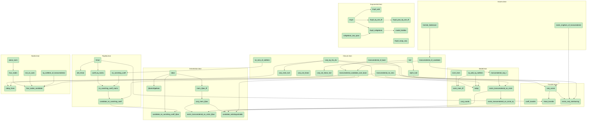

# Transcendence theory in Lean 4

This library proves classical theorems of transcendental number theory in Lean 4 with Mathlib, and
applies them to one open problem: Diaz's conjecture that a non-zero logarithm of an algebraic number never
has algebraic modulus.

It began as a study of that conjecture. Most of it is now the theory itself: the auxiliary-function
method of Gel'fond and Schneider, Siegel's lemma and Liouville's inequality, zero counts for exponential
polynomials, and the theorems they prove. All 307 results build in CI and depend only on Lean's three
standard axioms (`propext`, `Classical.choice`, `Quot.sound`).

The proofs are engineered as well as checked: cut into small results that later proofs import, with
shared tools stated for general use, and with the size of every proof kept down. See "Proof engineering".

No new transcendence theorem is claimed. The classical results are attributed below, and so are the Lean
proofs written by others. The results about Diaz's conjecture are mostly negative: they show which methods
cannot settle it.

## The classical theorems

| Result | Due to | Lean name | Lean proof |
|---|---|---|---|
| a non-zero logarithm of an algebraic number is transcendental | Hermite 1873, Lindemann 1882 | `Diaz.hermite_lindemann` | derived here from the next row |
| `e^{α₁}, …, e^{αₙ}` are linearly independent over Q̄ for distinct algebraic `αᵢ` | Lindemann 1882, Weierstrass 1885 | `linearIndependent_exp`, `algebraicIndependent_exp` | ported from Mathlib PR #28013 (unmerged) |
| `e^{bℓ}` is transcendental for algebraic irrational `b` and a non-zero logarithm `ℓ` | Gel'fond 1934, Schneider 1934 | `GelfondSchneider.gelfond_schneider` | restructured from M. Karatarakis and F. Wiedijk |
| `e^π` is transcendental | Gel'fond 1929 | `Diaz.e_pi_transcendence` | this project (the node was posed by another Prove2Me contributor) |
| the six exponentials theorem | Lang 1965–66, Ramachandra 1968 | `Diaz.six_exponentials` | this project |
| the four exponentials theorem in transcendence degree one | Waldschmidt 1973, Brownawell 1974 | `Diaz.four_exponentials_trdeg_one` | this project |
| two of `xᵢ, yⱼ, e^{xᵢyⱼ}` are algebraically independent when one column is algebraic | Waldschmidt 1973, Brownawell 1974 | `Diaz.two_algebraically_independent_of_exp_column` | this project |
| one of `e^e`, `e^{e²}` is transcendental (Schneider's eighth problem) | Waldschmidt 1973, Brownawell 1974 | `Transcendence.exp_e_or_exp_e_sq_transcendental` | this project |
| Roy's lemma on singular spaces of matrices | D. Roy (Dasgupta–Kakde II, Thm 2.2; a stronger form is DALAG Prop. 12.5) | `Transcendence.singular_matrix_subspace_annihilating_pair` | this project |
| Waldschmidt's transcendence criterion; zero counts for exponential polynomials | Waldschmidt 1971 | `Diaz.transcendence_criterion`, `Diaz.expPoly_zero_count` | this project |

Some results carry a conjecture as an explicit hypothesis: the strong four, sharp four and strong five
exponentials conjectures. Others carry Roy's strong six exponentials theorem, which is proved in the
literature but not yet here. "What is assumed" lists each one.

Names are the library's own; `MIRROR_CHECKLIST.md` maps each to its name on Prove2Me.

## Proof engineering

A proof that Lean accepts can still be hard to use. These proofs are also kept short enough to read,
cut where other proofs can reuse their parts, and written the same way throughout.

- **Small results.** Every result is a separate statement with its own proof. The size rule, counting
  lines of content without blanks and comments: a proof of 400 lines or more becomes a tree of results,
  and in a proof of 300 to 399 lines any helper over 40 lines becomes a result of its own. Two proofs
  still break it: Lindemann–Weierstrass as ported from Mathlib PR #28013, and
  `exists_iteratedDeriv_presentation` in the four exponentials development.
- **Import, don't re-prove.** A result is proved once and imported where it is needed; by script, no
  proof carries a helper whose statement is another result's. The proof of Waldschmidt's 1973 Théorème
  reuses 33 results of the four exponentials development unchanged.
- **Shared tools.** Pieces that several proofs need are results of their own in the `Transcendence`
  namespace, stated for general use rather than for the proof that first needed them: Siegel's lemma
  with an entrywise bound, Liouville's inequality in house form, the Cauchy estimate for an exponential
  polynomial on a grid, the length of integer polynomials under sums and products.
- **One layout.** Almost every result proved on Prove2Me is one module in `Diaz/Mirror/`, generated by a
  script from the accepted proof; its statement is the platform's, up to the namespace. The whole
  library builds on one version of Lean and Mathlib in CI.

What this has done so far:
- Five size waves, from 25 to 30 September 2026, took 27 proofs from 14,553 lines to 3,424. In the three
  waves where the new shared results were counted too, 8,963 lines became 5,052.
- One proof went from 1,550 lines to 44. Another carried 183 lines that no theorem used.
- Gelfond–Schneider was first carried as a single 5,388-line module, adapted from Karatarakis and
  Wiedijk's formalisation. It is now a tree of eleven results, 1,409 lines in all, and shares its grid
  estimate with the four exponentials development.

The sections below record each wave.

## Diaz's conjecture

Let `ℒ = {u ∈ ℂ : eᵘ ∈ Q̄ˣ}`, the logarithms of algebraic numbers. Diaz conjectured in 2004 that no non-zero
element of `ℒ` has algebraic modulus. He also asked a question of method: how could the non-holomorphic maps
`z ↦ z̄` and `z ↦ |z|` enter a transcendence proof at all?

The companion note (`tex/`) gives the mathematical account. Every branch of the conjecture is either closed
or reduced to two open statements. Each of the published conjectures above would settle it. The note also
records which methods cannot: in particular, nothing homogeneous on a candidate's own data, and the strong
six exponentials route stops at `u³`.

### The observation

Suppose `u ≠ 0` has `eᵘ` and `|u|` both algebraic, and put `ρ = u ū`.
Then

```
ū = ρ / u
```

so the conjugate of a candidate is not independent data — it is a
rational function of `u` with algebraic coefficients. Hence `Q̄(u)` is a
rational function field carrying an involution, and complex conjugation
on it is determined by the ring structure rather than being extra
information that might fail to be matched. Consequently no statement
about vanishing of matrix coefficients over `Q̄ ⊕ Q̄u ⊕ Q̄ū` can tell a
candidate apart from an ordinary complex number placed on the same
circle.

An entire style of attack — accumulate algebraic constraints on `u` and
`ū` until they collide — cannot settle the conjecture.

## Build

```bash
lake exe cache get && lake build Diaz
```

Lean 4.34.0, Mathlib v4.34.0.

## Dependency graph

Generated from the sources, not drawn by hand; the colouring is cross-checked
against `#print axioms` and agrees. Amber would mark a declaration imported as an
axiom and blue one resting on such an import; there are none left, so every node
is green, proved outright. The graph covers the original development only, not
the mirrored Prove2Me results under `Diaz/Mirror/`. Helper lemmas are omitted here for legibility; `dependency-graph.dot`
carries all 61, grouped by file. Both are transitively reduced: an edge
implied by a longer path is not drawn, so a declaration's full
dependency set is its ancestors, not just its parents.

Regenerate with `scripts/depgraph.py` after any change to the Lean;
nothing here is hand-maintained.


```mermaid
flowchart TD
  subgraph Axioms["Axioms.lean"]
    hermite_lindemann("hermite_lindemann")
    exists_ringHom_of_transcendental("exists_ringHom_of_transcendental")
  end
  subgraph Closure["Closure.lean"]
    hull("hull")
    transcendental_ne_zero("transcendental_ne_zero")
    ne_zero_of_notMem("ne_zero_of_notMem")
    conj_eq_rho_div("conj_eq_rho_div")
    conj_mem_hull("conj_mem_hull")
    conj_not_linear("conj_not_linear")
    conj_not_linear_hull("conj_not_linear_hull")
    eqOn_hull("eqOn_hull")
    transcendental_of_candidate("transcendental_of_candidate")
    transcendental_of_base("transcendental_of_base")
    transcendental_candidate_over_base("transcendental_candidate_over_base")
  end
  subgraph Model["Model.lean"]
    norm_form("norm_form")
    sq_add_sq_notMem("sq_add_sq_notMem")
    norm_mem_iff("norm_mem_iff")
    indep("indep")
    conj_coords("conj_coords")
    transcendental_exp_I("transcendental_exp_I")
    exists_transcendental_on_circle("exists_transcendental_on_circle")
    exists_transcendental_on_circle_sq("exists_transcendental_on_circle_sq")
  end
  subgraph Exponential["Exponential.lean"]
    isAlgebraic_two_rpow("isAlgebraic_two_rpow")
    Exp0("Exp0")
    Exp0_add("Exp0_add")
    Exp0_swap_conj("Exp0_swap_conj")
    Exp0_isAlgebraic("Exp0_isAlgebraic")
    Exp0_eq_one_iff("Exp0_eq_one_iff")
    Exp0_pow_eq_one_iff("Exp0_pow_eq_one_iff")
    model_falsifies("model_falsifies")
  end
  subgraph Transfer["Transfer.lean"]
    conj_comm("conj_comm")
    coeff_transfer("coeff_transfer")
    Hmat_transfer("Hmat_transfer")
    exists_conj_intertwining("exists_conj_intertwining")
  end
  subgraph Rigidity["Rigidity.lean"]
    Hmat("Hmat")
    det_Hmat("det_Hmat")
    no_vanishing_coeff("no_vanishing_coeff")
    coeff_eq_matrix("coeff_eq_matrix")
    no_vanishing_coeff_matrix("no_vanishing_coeff_matrix")
    candidate_no_vanishing_coeff("candidate_no_vanishing_coeff")
  end
  subgraph Instantiation["Instantiation.lean"]
    Qbar("Qbar")
    QbarIsAlgebraic("QbarIsAlgebraic")
    mem_Qbar_iff("mem_Qbar_iff")
    conj_mem_Qbar("conj_mem_Qbar")
    candidate_no_vanishing_coeff_Qbar("candidate_no_vanishing_coeff_Qbar")
    exists_transcendental_on_circle_Qbar("exists_transcendental_on_circle_Qbar")
    candidate_indistinguishable("candidate_indistinguishable")
  end
  subgraph Nodes["Nodes.lean"]
    not_on_axes("not_on_axes")
    plane_norm("plane_norm")
    indep_three("indep_three")
    four_nodes("four_nodes")
    sq_notMem_of_transcendental("sq_notMem_of_transcendental")
    four_nodes_candidate("four_nodes_candidate")
  end
  conj_eq_rho_div --> conj_mem_hull
  hull --> conj_not_linear_hull
  hull --> eqOn_hull
  hermite_lindemann --> transcendental_of_candidate
  transcendental_of_base --> transcendental_candidate_over_base
  transcendental_of_candidate --> transcendental_candidate_over_base
  norm_form --> norm_mem_iff
  sq_add_sq_notMem --> norm_mem_iff
  conj_eq_rho_div --> indep
  sq_add_sq_notMem --> indep
  transcendental_ne_zero --> indep
  transcendental_of_candidate --> transcendental_exp_I
  transcendental_exp_I --> exists_transcendental_on_circle
  transcendental_of_base --> exists_transcendental_on_circle
  exists_transcendental_on_circle --> exists_transcendental_on_circle_sq
  Exp0 --> Exp0_add
  Exp0 --> Exp0_isAlgebraic
  isAlgebraic_two_rpow --> Exp0_isAlgebraic
  Exp0 --> Exp0_eq_one_iff
  Exp0_eq_one_iff --> Exp0_pow_eq_one_iff
  Exp0_isAlgebraic --> model_falsifies
  conj_eq_rho_div --> conj_comm
  eqOn_hull --> conj_comm
  Hmat --> Hmat_transfer
  conj_comm --> Hmat_transfer
  conj_comm --> exists_conj_intertwining
  exists_ringHom_of_transcendental --> exists_conj_intertwining
  transcendental_ne_zero --> exists_conj_intertwining
  Hmat --> det_Hmat
  ne_zero_of_notMem --> no_vanishing_coeff
  Hmat --> coeff_eq_matrix
  coeff_eq_matrix --> no_vanishing_coeff_matrix
  no_vanishing_coeff --> no_vanishing_coeff_matrix
  no_vanishing_coeff_matrix --> candidate_no_vanishing_coeff
  transcendental_candidate_over_base --> candidate_no_vanishing_coeff
  Qbar --> QbarIsAlgebraic
  Qbar --> mem_Qbar_iff
  mem_Qbar_iff --> conj_mem_Qbar
  Qbar --> candidate_no_vanishing_coeff_Qbar
  candidate_no_vanishing_coeff --> candidate_no_vanishing_coeff_Qbar
  conj_mem_Qbar --> exists_transcendental_on_circle_Qbar
  exists_transcendental_on_circle --> exists_transcendental_on_circle_Qbar
  conj_mem_Qbar --> candidate_indistinguishable
  exists_conj_intertwining --> candidate_indistinguishable
  exists_transcendental_on_circle_sq --> candidate_indistinguishable
  transcendental_candidate_over_base --> candidate_indistinguishable
  conj_eq_rho_div --> indep_three
  transcendental_ne_zero --> indep_three
  plane_norm --> four_nodes
  four_nodes --> four_nodes_candidate
  not_on_axes --> four_nodes_candidate
  sq_notMem_of_transcendental --> four_nodes_candidate
  transcendental_candidate_over_base --> four_nodes_candidate
  classDef ax fill:#f5c26b,stroke:#b8860b,color:#000
  classDef onax fill:#bcd9f5,stroke:#3a6ea5,color:#000
  classDef proved fill:#c6e9c6,stroke:#3c8a3c,color:#000
  class hermite_lindemann,exists_ringHom_of_transcendental,hull,transcendental_ne_zero,ne_zero_of_notMem,conj_eq_rho_div,conj_mem_hull,conj_not_linear,conj_not_linear_hull,eqOn_hull,transcendental_of_candidate,transcendental_of_base,transcendental_candidate_over_base,norm_form,sq_add_sq_notMem,norm_mem_iff,indep,conj_coords,transcendental_exp_I,exists_transcendental_on_circle,exists_transcendental_on_circle_sq,isAlgebraic_two_rpow,Exp0,Exp0_add,Exp0_swap_conj,Exp0_isAlgebraic,Exp0_eq_one_iff,Exp0_pow_eq_one_iff,model_falsifies,conj_comm,coeff_transfer,Hmat_transfer,exists_conj_intertwining,Hmat,det_Hmat,no_vanishing_coeff,coeff_eq_matrix,no_vanishing_coeff_matrix,candidate_no_vanishing_coeff,Qbar,QbarIsAlgebraic,mem_Qbar_iff,conj_mem_Qbar,candidate_no_vanishing_coeff_Qbar,exists_transcendental_on_circle_Qbar,candidate_indistinguishable,not_on_axes,plane_norm,indep_three,four_nodes,sq_notMem_of_transcendental,four_nodes_candidate proved
```

The shape of it was the point, and it has changed. Everything is green. Two thin
chains used to be blue — transcendence of a candidate, and the existence of the
isomorphism — each ending at an amber node, Hermite–Lindemann and the Steinitz
extension. Both of those are now proved in `Axioms.lean`, so the chains rest on
nothing but Lean's own axioms.

## What is proved

`Closure.lean`
- `conj_eq_rho_div` — `ρ / u = conj u`. Everything rests on this line.
- `conj_mem_hull` — the subfield generated by `K` and `u` is stable under
  conjugation.
- `conj_not_linear`, `conj_not_linear_hull` — conjugation is not linear
  over any base containing a non-real number, stated on `ℂ` and on the
  hull. The hull form is the one the refuted claim needs, since
  `∀ z ∈ hull` is the weaker universal and so has the stronger negation.
- `eqOn_hull` — two ring homomorphisms agreeing on `K` and at `u` agree
  on the whole hull.

`Model.lean`
- `norm_form` — `(a t + b t̄)(a t̄ + b t) = (a²+b²) t t̄ + a b (t² + t̄²)`.
- `sq_add_sq_notMem` — the cross term is not in `K`, else `t` satisfies
  `X⁴ − c X² + ρ²`.
- `norm_mem_iff` — the elements of the rational plane with algebraic
  modulus are exactly the rational multiples of `t` and of `t̄`.
- `indep` — `t` and `t̄` are `ℚ`-independent, so plane coordinates are
  well defined.
- `conj_coords` — conjugation acts on the plane by swapping coordinates,
  which is what licenses stating the involution in coordinates.
- `exists_transcendental_on_circle` — such a `t` exists, with the
  explicit witness `r·e^i`. The hypotheses of the model results are not
  merely satisfiable in the abstract.

`Exponential.lean`
- `isAlgebraic_two_rpow` — `2^q` is algebraic for rational `q`.
- `Exp0_add`, `Exp0_swap_conj`, `Exp0_isAlgebraic` — a homomorphism into
  the algebraic numbers commuting with the involution.
- `Exp0_eq_one_iff`, `Exp0_pow_eq_one_iff` — this `Exp₀` has a divisible
  kernel and torsion-free image. See the caveat below: both are
  properties of the choice, not of the model.
- `model_falsifies` — the analogue of Diaz's conjecture is false in the
  model: a non-zero element of the plane with algebraic norm and an
  algebraic formal exponential.

`Transfer.lean`
- `conj_comm` — an isomorphism matching the generators *automatically*
  intertwines conjugation. Nothing has to be arranged.
- `exists_conj_intertwining` — the closure theorem with existence
  included: two candidates over the same base with the same `ρ` are
  carried onto one another by a conjugation-intertwining endomorphism.
- `coeff_transfer`, `Hmat_transfer` — vanishing of coefficients over `K`,
  and the matrix `H`, transfer.

`Instantiation.lean`
- `Qbar` — the algebraic numbers as a `Subfield ℂ`, with the
  `Algebra.IsAlgebraic ℚ` instance supplied. Mathlib has it, but it does
  not fire through the `IntermediateField → Subfield` coercion.
- `conj_mem_Qbar` — that base is conjugation-stable, as every result
  above assumes of its base.
- `candidate_no_vanishing_coeff_Qbar`,
  `exists_transcendental_on_circle_Qbar` — the end-to-end theorem and the
  model's existence hypothesis, over the base the note is actually about.
- `candidate_indistinguishable` — candidacy to indistinguishability in
  one statement: a candidate and an ordinary complex number on the same
  circle are carried onto one another by a conjugation-intertwining
  endomorphism fixing the base.

`Nodes.lean`
- `not_on_axes` — a candidate has `conj u ≠ u` and `conj u ≠ -u`, so it
  lies on neither axis.
- `indep_three` — `1`, `u`, `conj u` are independent over the base, which
  is what makes `W_u` three-dimensional.
- `plane_norm` — `(a u + b conj u)(a conj u + b u) = (a-b)²·u conj u
  + ab·(u + conj u)²` for rational `a, b`.
- `four_nodes`, `four_nodes_candidate` — inside the rational plane the
  points of the circle `z conj z = ρ` are determined: the four coordinate
  pairs `(±1,0)`, `(0,±1)`, that is `±u` and `±conj u`. The second takes
  the arithmetic hypotheses and derives the rest. Their distinctness, and
  so the count *four*, is not part of the formal statement.

`Rigidity.lean`
- `det_Hmat`, `coeff_factor`, `no_vanishing_coeff` — `H = [[u, r], [r, ū]]`
  has vanishing determinant, yet the coefficient is non-zero for all
  non-zero `w, v` over `K`. Dependent over `ℂ`, independent over `K`.
  Needs only `u ∉ K`, not transcendence.
- `coeff_eq_matrix`, `no_vanishing_coeff_matrix` — the hand-written
  coefficient *is* `wᵀ H v`, so the two results above concern one object.
- `candidate_no_vanishing_coeff` — the end-to-end statement: **if `u` is
  a Diaz candidate** over a base algebraic over `ℚ`, then `H` has no
  vanishing coefficient. This is the only place where the arithmetic
  hypothesis, rather than mere transcendence, is what is assumed.

## Where everything is

- `Diaz/` — the Lean library. Everything here builds in CI.
- `archive/prove2me/` — every accepted Prove2Me proof for this mission, verbatim, not built.
- `archive/local/` — proofs written for the mission and never published on the platform, not built.
- `MIRROR_CHECKLIST.md` — which Prove2Me results are already in `Diaz/`. The goal is all of them, and it is met: the count is at the top of this README. It includes the four `Schanuel.*` results
  proved for the mission (six exponentials, Hermite–Lindemann, Lindemann–Weierstrass,
  Gelfond–Schneider) and `e_pi_transcendence`, another contributor's node closed with
  Gelfond–Schneider.
- `scripts/refresh_prove2me_archive.py` — refreshes the archive and regenerates the checklist.
- `tex/` — the companion notes. The note selects from the library; the library does not select.

## The companion note

`tex/diaz_prove2me.tex` (and its PDF) is the mathematical account of what the
mirrored nodes say: the ceiling, the quantisation of the imaginary part, the
precise open boundary, two barriers and the branch that returns to its start,
and the exclusions that come from leaving the candidate's three-dimensional
hull. Every numbered statement in it carries a row in its Appendix A naming
the formal identifier, so a reader can check any claim against this repository
or against the platform rather than take it.

It is a published copy: the working copy lives elsewhere and is copied here
after a script re-checks each appendix row against the live board.

**Stable version 1.0** (2026-09-21) is tagged `note-v1.0`, with the PDF attached to
the matching GitHub release. It records the end of the case analysis: every branch
of the conjecture is closed or reduced to one of three open statements, named in its
last section. The older
`tex/diaz-modulus.tex` is a different and earlier note, about the model and the
negative result, and is not superseded by it.

## Backup of the Prove2Me nodes

Prove2Me holds the proofs; this repository is where they are kept. Anything
proved there and worth keeping is mirrored here, because a platform is not a
place to store the only copy of a result.

`Multipliers.lean`, `SFE.lean`, `Quantisation.lean`, `Line.lean`,
`Pencil.lean`, `Kernel.lean`, `CheapLine.lean` and `Distance.lean` are that mirror. They are stated in the platform's vocabulary
— `LogAlg`, `LogAlgTilde`, `IsCandidate`, mirroring its `DiazModulus`
preamble — rather than in this repository's abstract-subfield style, so that
the declarations read the same in both places.

| Here | On the platform |
| --- | --- |
| `diaz_of_sfe`, `diaz_of_sfe_hl` | `DiazModulus.diaz_of_sfe` |
| `candidate_multiplier_module` | `DiazModulus.candidate_multiplier_module` |
| `candidate_one_log_saturation` | `DiazModulus.candidate_one_log_saturation` |
| `no_algebraic_line` | `DiazModulus.no_algebraic_generalized_line` |
| `candidate_no_real_algebraic_line` | `DiazModulus.candidate_no_real_algebraic_line` |
| `candidate_distance_transcendental` | `DiazModulus.candidate_distance_transcendental` |
| `real_quantisation` | `Diaz.real_quantisation` |
| `quantisation_orbit_iff_re_ne_zero` | `Diaz.quantisation_orbit_iff_re_ne_zero` |
| `leaf_iff_one` | `DiazModulus.leaf_iff_one` |
| `exp_ratMul_isAlgebraic`, `exp_ratio_pow_eq_one_iff` | same names |
| `det_pencil_eq_conic`, `roy_conic_implies_empty` | same names |
| `candidate_re_transcendental`, `candidate_im_transcendental`, `candidate_vanishing_ideal` | `DiazModulus.candidate_re_transcendental`, `DiazModulus.candidate_im_transcendental`, `DiazModulus.candidate_vanishing_ideal` |
| `sixExponentials_cannot_refute_candidate` | same name |
| `fibre_at_most_two` | `Diaz.fibre_at_most_two` |
| `hermite_lindemann_holds` | `DiazModulus.hermite_lindemann_holds` |
| `q_translate_unique`, `order_quantisation`, `torsion_dichotomy`, `period_plane_norm`, `indep_of_algebraic_product`, `no_holo_stab` | same names |

Every one of them is `sorry`-free and depends on no axiom of this repository:
`#print axioms` lists only `propext`, `Classical.choice`, `Quot.sound`.

That now includes `diaz_of_sfe`. Hermite–Lindemann is no longer assumed for
it: `HermiteLindemann.lean` proves `hermite_lindemann_holds`, and
`diaz_of_sfe` discharges its hypothesis from that theorem rather than from
`Axioms.lean`, where it is now proved as well.

The transcendence inputs stay explicit hypotheses of each statement rather
than joining `Axioms.lean`: on the platform they are carried the same way,
and the point of a mirror is that it reads identically.

`DiazModulus.diaz_of_schanuel`, the last to arrive, is mirrored too. An earlier
note here blamed a missing `Algebra ↥R ↥F` instance on the older Mathlib; that was
wrong. A hand port had dropped `open IntermediateField.algebraAdjoinAdjoin`, and the
mechanical port only needed the submission's open `noncomputable section` closed
before the namespace ends.

`HermiteLindemann.lean` and `Fibre.lean` share the Lindemann–Weierstrass
development ported from an unmerged Mathlib pull request. It is kept once, in
the former, and imported by the latter.

### The first two, in detail

`Multipliers.lean` is not part of the note. It is a local copy of two
results published on [Prove2Me](https://prove2.me) in September 2026, kept
here so that they survive independently of that platform. They are stated
in the platform's own vocabulary — `LogAlg`, `LogAlgTilde`, `IsCandidate`,
mirroring its `DiazModulus` preamble — rather than in this repository's
abstract-subfield style, so that the declarations read the same in both
places.

- `candidate_multiplier_module` — under Roy's strong six exponentials
  theorem and Hermite–Lindemann, the set of `z ∈ ℒ̃` with `u z ∈ ℒ̃` is
  exactly `Q̄ + Q̄/u`. Consequently `u² ∉ ℒ̃`, and `1/(u − a) ∉ ℒ̃` for every
  non-zero algebraic `a`, even though `1/u` itself is necessarily in `ℒ̃`.
  These are cases of Diaz (J. Théor. Nombres Bordeaux 19, 2007, Théorème 4(1)
  and Corollaire 5) and of Waldschmidt's *Variations on the six exponentials
  theorem* (2005), Corollary 2.2. Node `69387a9d-5e97-4b55-b6e6-64fa30ba558f`.
- `candidate_one_log_saturation` — a candidate lying in `Q̄ + Q̄ℓ` for a
  single `ℓ ∈ ℒ` lies in `Qℓ`; at `ℓ = iπ` this rules out candidates of the
  form `a + bπ`. Node `cf5024d1-43b6-47ac-b3dd-5298beba22a4`.

These two complement `Nodes.lean` and the dimension count behind it. That
count bounds what the three-dimensional hull `span_Q̄{1, u, ū}` of a
candidate can contain, and so says a six-exponentials template cannot be
assembled inside it. The multiplier module says what an extension of the
hull would have to be, and that no algebraic operation on `u` supplies one.

The transcendence inputs stay explicit hypotheses of each statement rather
than joining `Axioms.lean`: on the platform they are carried the same way,
and the point of a backup is that it reads identically. Neither theorem
depends on any axiom of this repository — `#print axioms` on both lists
only `propext`, `Classical.choice`, `Quot.sound`.

## Four exponentials in transcendence degree one

`Diaz/Mirror/` carries a complete proof of the four exponentials theorem in transcendence
degree one, as `DiazModulus.four_exponentials_trdeg_one`. In the form the node
states it: take a 2×2 matrix of non-zero logarithms of algebraic numbers with
`l₁₁l₂₂ = l₁₂l₂₁`, and suppose the field they generate has transcendence degree
at most one; then its rows or its columns are `ℚ`-dependent. Equivalently, two
`ℚ`-independent pairs `x₁, x₂` and `y₁, y₂` whose four products `xᵢyⱼ` are all
logarithms of algebraic numbers generate a field of transcendence degree at
least two. The theorem is classical, proved independently by Brownawell (1974)
and Waldschmidt (1973); no new mathematics is claimed for it.

The route is Waldschmidt's 1973 proof together with the toolbox of his 1971
paper, so it needs neither a lower bound for linear forms in logarithms nor
Philippon's zero estimate. The printed 1973 proof meets one hypothesis of its
Lemme 2 with Gel'fond's two-logarithm bound, which Baker generalised; the
separation-free zero count of 1971 makes that hypothesis unnecessary:

- `transcendence_criterion` — Gel'fond's criterion in the 1971 form: a number
  approximated well enough by integer polynomials of controlled degree and
  height is algebraic. Under it, `small_irreducible_factor`, `height_dvd_le` and
  the resultant bound.
- `expPoly_zero_count` and its scaled form — Tijdeman's count of the zeros of an
  exponential polynomial in a disc, with no separation hypothesis on the
  frequencies. This is what replaces Baker.
- `cauchy_estimate_with_zeros` and `extrapolation` — the Schwarz step: high-order
  vanishing on a small grid makes the derivatives tiny on a grid fourteen times
  larger.
- `trdeg_one_presentation`, `aux_linear_system`, `siegel_aux` — the arithmetic of
  the auxiliary function: write everything over `ℤ[ω, ω₁]`, turn the vanishing
  conditions into an integer linear system, and solve it by Siegel's lemma.
- `norm_to_polynomial_alg` — the value becomes an integer polynomial in one
  variable, small at `ω`. Instead of taking a norm, it takes the determinant of
  multiplication modulo the minimal relation, which avoids building the field
  extension at all.
- `construction_core_1973`, `auxiliary_construction`,
  `small_polynomials_of_counterexample`, `rank_one_parametrization`,
  `construction_growth`, `construction_count_1973` — the assembly and its
  bookkeeping.

The theorem settles one case of the conjecture's branch structure
(`DiazModulus.diaz_of_exp_not_real_irrational_angle_period_aligned_norm_rat_mult`).
What still blocks that branch is one statement about `1/π`: the real half of
(S), that `e^{-iγ/π}` is transcendental for real algebraic `γ ≠ 0`. Until
2026-09-23 the imaginary half was carried too. Both branches that reach (S)
produce a real `γ`, and two new reductions record this, so the imaginary half
is no longer needed. By `DiazModulus.recip_pi_not_log_real_or_imag`, the two
halves cannot both fail.

The theorem has consequences beyond that case, all in `Diaz/Mirror/`:

- `log_pair_rigid_of_trdeg_one` — two non-zero logarithms `u, v` with
  `|u|²/|v|²` rational, and `u, ū, v, v̄` of transcendence degree at most one,
  satisfy `v ∈ ℚu ∪ ℚū`. For `K = Q̄` this is an unconditional and stronger form
  of the conditional `quadric_trdeg_two`.
- `candidate_monomial_not_log` — for a candidate `u`, `e^{c u^k}` is
  transcendental when `k ≥ 2` and `|c|²|u|^{2(k−1)}` is rational. One example
  is `e^{u²/|u|}`. It is the unconditional part of the exclusion
  `u² ∉ ℒ̃`, which needs Roy's strong six exponentials theorem.
- `geometric_triple_not_logs` — `w`, `wz`, `wz²` are not all logarithms of
  algebraic numbers when `z ∉ ℚ` and `trdeg ℚ(w, z) ≤ 1`. Hence
  `exp_pi_sq_or_exp_i_pi_cube_transcendental`: at least one of `e^{π²}` and
  `e^{iπ³}` is transcendental. Both are classical: Waldschmidt, *Nombres
  transcendants* (LN 402, 1974), Cor. 7.4.3, and Waldschmidt, J. Number Theory 5
  (1973), Cor. 2, found independently by Brownawell (1974).
- `diaz_number_forces_transcendence` — if `t² + π²` is algebraic for a real
  logarithm `t`, then `e^{it²/π}`, `e^{π²/t}` and `e^{(t²+π²)/(iπ)}` are
  transcendental. Hence `log_two_diaz_or_transcendental`: **at least one of
  `√((log 2)² + π²)` and `2^{i log 2/π}` is transcendental.** The first number is
  the smallest open instance of Diaz's conjecture. The third conclusion says that
  the two remaining open boundary statements cannot fail at the same number.
  Stronger forms of the first two conclusions are classical: they need only `t`
  algebraic over `ℚ(π)` (LN 402, p. 202), so `2^{i log 2/π}` is transcendental
  as soon as `log 2` and `π` are algebraically dependent.
- `recip_pi_or_pi_cube`, `exp_i_div_pi_or_exp_i_pi_cube_transcendental` — each
  instance of (S) has a partner; at least one of `e^{i/π}` and `e^{iπ³}` is
  transcendental. Classical: Waldschmidt 1973, Cor. 4 and the remark after it.
- `candidate_harmonic_not_log` — for a candidate, `|u|²/(pu + qū)` is not a
  logarithm of an algebraic number; in particular neither is the harmonic mean
  of `u` and `ū`.

With the six exponentials theorem, two candidates of commensurable moduli supply
the dimension that one candidate lacks. `log_ratio_multipliers` identifies what
`u/v` multiplies back into ℒ. `candidate_quotient_rigid` and
`candidate_product_relation_trivial` prove that the arguments of the candidates
on a circle of algebraic radius form a Sidon set up to conjugation, which is the
first constraint on algebraically independent families of candidates.
`candidate_neg_one_pow_ratio` makes `(−1)^{u/ū} = e^{iπu/ū}` transcendental for
every candidate. The duality `log_square_duality`, the `ℚ`-linear form of
Diaz 2007, Corollaire 4(3), gives `two_pow_log_three_or_three_pow_log_two`: at
least one of `2^{log₃2}` and `3^{log₂3}` is transcendental.

At rational squared moduli the theorem gives four statements of 29 September 2026. None of them
was found in the sources read, and each follows from the theorem in a few lines.
`nongeneric_rational_modulus_orbit`: logarithms of algebraic numbers that are algebraic over
`ℚ(π)` and have rational squared modulus are rational multiples of one another, up to
conjugation. `torsion_rational_modulus_unique`: at most one pair `±t` with `e^t` algebraic makes
`t² + π²` rational, so `log_two_log_three_not_both_rational`: `(log 2)² + π²` and
`(log 3)² + π²` are not both rational. `recip_pi_log_of_torsion_rational_modulus`: a rational
value of `t² + π²` would make `e^{iγ/π}` transcendental at every rational `γ ≠ 0`, so Diaz's
conjecture at `t + iπ` and the statement (S) cannot both fail at rational data. With
Waldschmidt's 1973 theorem in its algebraic-independence form carried as a hypothesis,
`pi_e_exp_pi_sq_indep_of_exp_i_rat_div_pi` specialises it: if `e^{ir/π}` is algebraic for a
rational `r ≠ 0`, then two of `π`, `e`, `e^{π²}` are algebraically independent. The next section
proves the theorem, and `pi_e_exp_pi_sq_indep_of_exp_i_rat_div_pi_algebraic` drops the hypothesis.

### Waldschmidt 1973, and Schneider's eighth problem

`DiazModulus.two_algebraically_independent_of_exp_column` is the Théorème of Waldschmidt 1973 in full:
if `x₁, x₂` and `y₁, y₂` are `ℚ`-independent and one column, `e^{x₁y₂}` and `e^{x₂y₂}`, is algebraic,
then two of the eight numbers `xᵢ`, `yⱼ`, `e^{xᵢyⱼ}` are algebraically independent. Brownawell found it
independently (1974). It reuses 33 nodes of the four exponentials development above unchanged. Twelve
new nodes carry the column case, where `e^{x₁y₁}` and `e^{x₂y₁}` are only algebraic over `ℚ(ω)`, so
their powers cost degree. They are sampled along the short side of the interpolation grid, where the
degree budget absorbs them. Three consequences follow:

- `Transcendence.exp_e_or_exp_e_sq_transcendental` — Schneider's eighth problem, which gave the 1973
  paper its title: at least one of `e^e` and `e^{e²}` is transcendental.
- `DiazModulus.algebraicIndependent_e_pi_of_exp_pi_sq_algebraic` — if `e^{π²}` is algebraic, then `e`
  and `π` are algebraically independent (Corollaire 1 at `α = −1`).
- `DiazModulus.pi_e_exp_pi_sq_indep_of_exp_i_rat_div_pi_algebraic` — the previous section's
  specialisation, now unconditional.

No new mathematics is claimed for any of them.

### Consequences of Roy's strong six exponentials theorem

Ten nodes carry Roy's strong six exponentials theorem as the hypothesis `hSSE`, in the form of
`candidate_multiplier_module`: if `x₁, x₂` and `y₁, y₂, y₃` are linearly independent over `Q̄`, one of
the six products `xᵢyⱼ` is not in `ℒ̃`. Every statement was read on the page first.

- `DiazModulus.strong_six_exponentials_iff_quotient_form` — Diaz 2007, Théorème 3: the theorem is
  equivalent to its four-logarithm quotient form. No hypothesis; it also connects the two forms in
  which earlier nodes carry the theorem.
- `DiazModulus.diaz_2007_cor1_PQ`, `diaz_2007_cor2_P_consequences`, `diaz_2007_cor4`,
  `diaz_2007_cor5` — Diaz 2007, Corollaires 1 (PQ), 2 (P) 2) with its Conséquences 1–3, 4 and 5, in
  general.
- `DiazModulus.candidate_cube_and_axis_multiple_not_mem_logAlgTilde` — every candidate has
  `u³ ∉ ℒ̃`, and `λu ∉ ℒ̃` for every transcendental `λ ∈ ℒ̃` on the real or imaginary axis; so
  `e^{βπu}` is transcendental for every algebraic `β ≠ 0`. Diaz's general proofs use Baker's theorem;
  at a candidate, Hermite–Lindemann does that step.
- `DiazModulus.pi_powers_not_both_mem_logAlgTilde` — `π²` and `π³`, `π²` and `1/π`, `1/π` and `1/π²`
  are pairwise not both in `ℒ̃` (Diaz's own instances at `λ = iπ`). An exception to (S) would therefore
  make `e^{π²}` transcendental.
- `DiazModulus.algebraic_modulus_log_multiplier_rational` — with Baker's theorem as a second
  hypothesis: if `λ ∈ ℒ ∖ {0}`, `u ∈ ℒ̃`, and `|u|` and `e^{uλ}` are algebraic, then `u ∈ ℚ` or
  `uλ/λ̄ ∈ ℚ`. For arbitrary `u` this is an open question in Waldschmidt's book (2000, p. 399), which
  derives it from the strong four exponentials conjecture (`algebraic_modulus_log_multiplier_rational_of_sfe`,
  below); the derivation of the case `u ∈ ℒ̃` was not found in the sources read.
- Two helpers: `logAlgTilde_conj_stable` and `quadratic_eq_zero_of_not_mem_Qbar`.
- The rest of Diaz 2007 §2, added the same day: `diaz_2007_cor3_Q`, `diaz_2007_th4`,
  `diaz_2007_cor6`, `diaz_2007_th5`, `diaz_2007_cor7` (the modular statement (C4) of Diaz 1997 when τ or
  1/τ lies in `ℒ̃`), `diaz_2007_th6` and `diaz_2007_th7` (`u, u², u³` not all in `ℒ̃`). Parts that need
  it carry Baker's theorem as a second hypothesis.

Apart from that one derivation, no new mathematics is claimed.

### Where the strong six exponentials route stops

`DiazModulus.power_hull_strong_six_exp_configuration_iff`: for transcendental `u` and `k ≥ 1`, a
configuration of the strong six exponentials theorem with all six products in
`Q̄u⁻ᵏ + Q̄u⁻¹ + Q̄ + Q̄u + Q̄uᵏ` exists iff `k = 2` or `k = 3`. At a candidate, `ℒ̃` contains `1`, `u` and
`ū = |u|²/u`, and with `uᵏ` also `ūᵏ`; so the theorem, fed with the candidate's own data, excludes
`u²` and `u³` from `ℒ̃` and no higher power. The proof counts orders at `0` of polynomials supported on
`{0, k−1, k, k+1, 2k}`. Not found in the sources read; Diaz (2007, p. 390) remarks that inside that
theorem one cannot hope to go very far.

### The Matrix Coefficient Conjecture sees nothing homogeneous either

- `Transcendence.singular_matrix_subspace_annihilating_pair` — Roy's lemma (Dasgupta–Kakde II,
  Thm 2.2; a stronger form is Waldschmidt's book, Prop. 12.5): over an infinite field, a linear space of
  singular `n × n` matrices has non-zero `v, w` with `wᵀAv = 0` for all its elements.
- `DiazModulus.generic_no_homogeneous_relation` — for `u` and `π` algebraically independent with `|u|²`
  algebraic, no non-zero homogeneous polynomial over `Q̄` vanishes at `(u, ū, iπ)` (an instance of the
  book's Prop. 12.13).
- `DiazModulus.generic_matrix_coefficient_barrier` — in that setting every singular `n × n` matrix over
  `ℚu + ℚū + ℚiπ` (resp. `Q̄u + Q̄ū + Q̄iπ`) has non-zero rational (resp. algebraic) `v, w` with
  `wᵀMv = 0`: the Matrix Coefficient Conjecture of Dasgupta and Kakde, and its `Q̄` form, hold on these
  matrices in every size, as the four exponentials conjecture does at `n = 2`.

### Strong four, sharp four and strong five exponentials

Three nodes of 2026-10-01, each carrying a conjecture as a hypothesis:

- `DiazModulus.sharp_four_and_strong_five_exponentials_of_strong_four` — the strong four exponentials
  conjecture (the hypothesis of `diaz_of_sfe`), with Baker's theorem, implies the sharp four exponentials
  conjecture, and that one implies the strong five (Waldschmidt's remark, 1988, p. 379). Both conclusions
  are stated in the forms of `diaz_of_sharp_four_exponentials` and `diaz_of_strong_five_exponentials`,
  and plug into them.
- `DiazModulus.algebraic_modulus_log_multiplier_rational_of_sfe` — the open question of Waldschmidt's
  book, p. 399, for every `u`, from the strong four exponentials conjecture as the book says: if
  `λ ∈ ℒ ∖ {0}` and `|u|`, `e^{uλ}` are algebraic, then `u ∈ ℚ` or `uλ/λ̄ ∈ ℚ`. No Baker.
- `DiazModulus.exp_log_mul_log_transcendental_of_strong_five` — under the strong five exponentials
  conjecture, `(log a)(log b) ≠ log c` for non-zero logarithms (Waldschmidt 1988, p. 379); so `e^{λ²}`
  and `e^{π²}` are transcendental (Waldschmidt 2005).

No new mathematics is claimed for these three.

### A barrier: the four exponentials conjecture sees nothing homogeneous

A candidate certifies three logarithms: `u`, `ū` and `iπ`. On them, the four
exponentials *conjecture* (ℚ-independent rows and columns, products in ℒ) is
already a theorem, so it can give nothing.

- `generic_conj_pair_no_quadratic_relation` — if `|u|²` is algebraic and `u`, `πi`
  are algebraically independent over Q̄, no rational quadratic form vanishes at
  `(u, ū, iπ)`. It does not use `e^u`.
- `generic_conj_pair_four_exp_barrier` — hence every singular 2×2 matrix over
  `ℚu + ℚū + ℚiπ` has ℚ-dependent rows or columns. `det_zero_linear_forms_rank_one`
  is the classical linear-algebra step.
- `candidate_nongeneric_four_exp_barrier` — the same conclusion for candidates
  algebraic over ℚ(π), where the proved four exponentials theorem in
  transcendence degree one does the work.
- `recip_pi_log_four_exp_barrier` — the same on `ℚ·γ/(iπ) + ℚ·iπ`, the data an
  exception to (S) would certify.

A configuration that does detect a counterexample needs an entry with a constant
term, as in `diaz_of_sfe`. For a generic candidate the constant is all it can add:

- `generic_quadratic_relation_is_norm` — with algebraic coefficients and a constant
  coordinate, the only quadratic relation among `1, u, ū, iπ` is the norm
  `X₁X₂ − ρX₀²`, up to a factor.
- `generic_period_never_enters` — in a singular 2×2 matrix over
  `Q̄ + Q̄u + Q̄ū + Q̄iπ` with Q̄-independent rows and columns, the coefficient of `iπ`
  in every entry is zero. `det_zero_linear_forms_rank_one_field` is the
  linear-algebra step, over any field of characteristic zero.
- `generic_qbar_homogeneous_four_exp_barrier` — with algebraic coefficients but no
  constant there is still no 2×2 configuration over `Q̄u + Q̄ū + Q̄iπ`.
- `generic_no_strong_six_exp_configuration` — no 2×3 configuration even over
  `Q̄ + Q̄u + Q̄ū + Q̄iπ`: the proved strong six exponentials theorem gives nothing
  against a generic candidate, even with `iπ` added.

Points of a circle can carry homogeneous relations; candidates cannot. For a
candidate algebraic over ℚ(π) with `Im u ∉ ℚπ`, Théorème 0.2 of Roy–Waldschmidt
(Ann. Sci. École Norm. Sup. 30, 1997) excludes every rational quadratic relation
among `u, ū, iπ`. That theorem is not formalised here. What the nodes below add is
that no 2×2 configuration sees an anisotropic relation:

- `conj_pair_quadratic_relation_iff` — for `u` off the axes with `Im u ∉ ℚπ`, the
  rational quadratic relations among `u, ū, iπ` are exactly the identities
  `Q(Im u, π) = s|u|²`.
- `anisotropic_relation_four_exp_barrier` — a relation whose form has no rational
  zero never yields a configuration, because every 2×2 determinant of rational
  linear forms has one (`det_linear_forms_isotropic`). It uses the transcendence
  of π, not `e^u`.
- `anisotropic_relation_on_circle` — such relations occur: `Re(u²) = π²` at points
  of every circle of algebraic radius greater than π. By Roy–Waldschmidt, `e^u` is
  transcendental at those points, so none of them is a candidate.

Indistinguishability also holds with π fixed:

- `circle_points_indistinguishable` — two points of a circle, transcendental over a
  conjugation-stable field `K` containing the squared radius, are indistinguishable
  over `K`.
- `exists_noncandidate_transcendental_on_circle` — every circle of positive radius
  has a point transcendental over a given countable field, with `e^t` transcendental.
- `generic_indistinguishable_over_pi` — with `K` the algebraic closure of ℚ(π), a
  candidate algebraically independent of π cannot be told from a non-candidate
  point of its circle by any vanishing statement with coefficients in `K`.

The companion note, version 1.8, states all of this precisely.

### From the literature, formalised

The reading of Diaz, Roy and Waldschmidt on 24 September 2026 produced twelve
more nodes, all in `Diaz/Mirror/`. Most are published results, formalised and
attributed as such; two are new couplings.

Known results, now machine-checked:

- `exp_abs_transcendental_of_conj_algebraic` — for a non-real logarithm `λ` with
  `λ̄` algebraic over `ℚ[λ]`, `e^{|λ|}` is transcendental (Diaz 1997, Prop. 2;
  Roy–Waldschmidt 1997, Cor. 7.4). At `λ = iπ` it gives `e^π`. It is the
  unconditional form of `Diaz.log_modulus_forces_independence`.
- `exp_abs_log_two_add_i_pi_transcendental` — if `log 2` is algebraic over
  `ℚ(π)`, then `exp √((log 2)² + π²)` is transcendental (Roy–Waldschmidt's
  example, 1997, p. 792).
- `log_pair_square_ratio_transcendental` — for `ℚ`-independent logarithms
  `ℓ₁, ℓ₂` with `ℓ₁` algebraic over `ℚ[ℓ₂]`, both `e^{ℓ₁²/ℓ₂}` and `e^{ℓ₂²/ℓ₁}`
  are transcendental (Waldschmidt, LN 402, 1974, p. 202).
- `log_two_pi_dependent_forces_transcendence` — its case `log 2`, `iπ`: if
  `log 2` and `π` are algebraically dependent, `2^{i log 2/π}` and
  `e^{π²/log 2}` are transcendental. This strengthens
  `log_two_diaz_or_transcendental`.

Weaker published conjectures that already give Diaz's conjecture and (S). Each
is inlined as an explicit hypothesis, as the strong four exponentials conjecture
is in `diaz_of_sfe`:

- `diaz_of_strong_five_exponentials`, `recip_pi_not_log_of_strong_five_exponentials`
  — Waldschmidt's strong five exponentials conjecture (1988), which he calls
  weaker than the strong four exponentials conjecture of that paper: the sharp
  four exponentials conjecture of the next item, not the hypothesis of
  `diaz_of_sfe`. With `x₁ = y₁ = 1` its fifth exponential is one of the four.
- `diaz_of_sharp_four_exponentials`, `recip_pi_not_log_of_sharp_four_exponentials`
  — the sharp four exponentials conjecture (Waldschmidt 2005; 1988, p. 377).
- `diaz_of_two_by_two_determinant_conjecture`,
  `recip_pi_not_log_of_two_by_two_determinant_conjecture` — Conjecture 1.6 of
  Waldschmidt's *Further variations on the six exponentials theorem* (2005):
  a 2×2 matrix over `ℒ̃` with suitably independent rows and columns has
  determinant outside `ℒ̃`. For Diaz the matrix is `H(u, |u|)`.

Two new couplings, both from the four exponentials theorem in transcendence
degree one:

- `candidate_norm_div_log_not_log` — for a candidate `u` and a logarithm `x`
  algebraic over `ℚ[u]` outside `ℚu ∪ ℚū`, `e^{|u|²/x}` is transcendental. It
  generalises `candidate_harmonic_not_log`.
- `candidate_norm_recip_pi_not_log` — its analogue at `x = iπ`: for every
  candidate algebraic over `ℚ(π)`, the real half of (S) holds at `γ = |u|²`.
  A non-generic counterexample to Diaz's conjecture never yields, through its
  squared modulus, a counterexample to (S).

Five more the same day. They came from a size audit of the library that
applied the platform's own rule on how large a helper may be before it
becomes a node:

- `Transcendence.trdeg_adjoin_le_one_of_isAlgebraic_adjoin` — for fields
  `K ⊆ L`, elements algebraic over `K[x]` generate a `K`-algebra of
  transcendence degree at most one. Fourteen proofs in this library carry it
  as a local helper; new proofs import it.
- `log_pair_algebraicIndependent_of_mul_eq_rat_pi_sq` — Diaz 1997,
  Proposition 1: if `ℓ₁ℓ₂ = cπ²` with `c ∈ ℚ^×` and `e^{ℓ₁}` not a root of
  unity, then `ℓ₁, ℓ₂` are algebraically independent, and so are `ℓ₁, 2πi`.
- `exp_two_pi_I_mul_transcendental_of_normSq_rat` — the case of Diaz's
  property (4-1) where `τ` is algebraic over `ℚ(π)`: for non-real `τ` with
  `|τ|² ∈ ℚ`, `e^{2πiτ}` is transcendental.
- `div_not_mem_logAlgTilde_of_sfe` — under the strong four exponentials
  conjecture, `Λ₂/Λ₁ ∉ ℒ̃` whenever `Λ₁, Λ₂ ∈ ℒ̃` and `Λ₁`, `Λ₂/Λ₁` are
  transcendental (Waldschmidt 2005, Consequence 1.7). His Consequence 1.6 is
  the case `Λ₂ = 1`, and at `Λ₁ = iπ` it gives `1/(iπ) ∉ ℒ̃`.
- `e_pi_transcendence` — `e^π` is transcendental (Gelfond 1929), as an
  instance of the Gelfond–Schneider theorem proved here. It closes another
  contributor's node, which had been open since June 2026.

On 25 September the same audit took four general results out of proofs that
carried them inline, and made each a node:

- `exp_abs_transcendental_of_isAlgebraic_adjoin` — if `e^λ` is algebraic, `λ`
  is not real, and `λ`, `λ̄` are algebraic over one ring `ℚ[x]`, then
  `e^{|λ|}` is transcendental.
- `qbar_dependent_of_det_linear_forms` — if each product `x_i y_j` of a 2×2
  block is an algebraic linear form in four fixed numbers, and the block's
  determinant vanishes identically as a quadratic form, then the `x`'s or the
  `y`'s are linearly dependent over `Q̄`.
- `Transcendence.circle_vanishing_ideal` — for a subfield `K` of `ℂ`, a point
  of the circle `x² + y² = ρ ≠ 0` whose `y` is transcendental over `K` lies on
  no curve over `K` except multiples of the circle.
- `dvd_of_small_values_at_scale` — one scale of Gel'fond's transcendence
  criterion.

Nine results were proved again, importing these or a node they had re-proved.
On the platform those nine proofs went from 2,865 lines to 856. Here, seven
mirror modules were regenerated from the new proofs, and `Kernel.lean` now
derives `candidate_vanishing_ideal` from the circle node: 130 lines instead
of 472.

A second wave the same day took apart `aligned_norm_free_no_rational_log_matrix`,
until then a single 1,550-line proof, most of which it never used. It is now
44 lines, from three new nodes:

- `Transcendence.quadratic_coeffs_eq_zero_of_transcendental` — a transcendental
  number is a root of no non-zero quadratic with algebraic coefficients.
- `four_exp_barrier_of_no_quadratic_relation` — if numbers satisfy no rational
  quadratic relation, a singular 2×2 matrix of rational linear forms in them
  has rationally dependent rows or columns. The `*_four_exp_barrier` results
  each proved this step inline.
- `aligned_norm_free_no_quadratic_relation` — in the aligned, norm-free case,
  `u`, `ū` and `2πi` satisfy no rational quadratic relation.

`recip_pi_log_four_exp_barrier`, `generic_conj_pair_four_exp_barrier` and
`period_free_split_nondegenerate` were proved again from them. The four proofs
went from 2,725 lines to 320.

A third wave took on the two proofs of Waldschmidt's 1973 Lemmas 4 and 7,
`aux_linear_system` and `norm_to_polynomial_alg`. Each carried the same
1,046-line block of helpers. Eight nodes replace it:

- `Transcendence.length_sum_le` and `Transcendence.length_mul_le` — the length
  of integer polynomials (the sum of the absolute values of the coefficients)
  of a finite sum, and of a product.
- `Transcendence.exists_int_pow_repr` — scaled powers of an algebraic number are
  integer combinations of a fixed basis, with coefficients at most `Aⁿ`.
- `Transcendence.exists_modByMonic_length_le` — reduction modulo any polynomial
  multiplies the length by at most `Cⁿ`.
- `exists_iteratedDeriv_presentation` — the derivatives of an exponential
  polynomial at a grid point, presented through the four exponentials, for any
  coefficients. `exists_iteratedDeriv_reduced_presentation` adds the unknowns
  and the reduction modulo `Q`.
- `exists_pow_mul_pow_le_exp_sq_mul_sqrt_log` — the asymptotic estimate at the
  scale `N²/√log N`.
- `exists_int_norm` — the core of Lemma 7, the norm from `ℚ(ω, ω₁)` down to
  `ℚ(ω)` with size control.

The two proofs went from 4,068 lines to 458, and 2,173 with the new nodes.

A fourth wave took on the remaining proofs of 300 lines or more:
`extrapolation`, `siegel_aux`, `small_irreducible_factor` and
`trdeg_one_presentation` in the four exponentials subtree, and the six
exponentials steps `SX.descent_step` and `SX.exists_aux_expSum`. Eight nodes:

- `Transcendence.siegel_entrywise` — Siegel's lemma with an entrywise bound:
  with at least twice as many unknowns as equations and entries at most `B`,
  a non-zero integer solution of size at most `nB`.
- `Transcendence.expPoly_grid_estimate` — the Cauchy estimate for an
  exponential polynomial that vanishes to order `n` on a grid of `ℚ`-linearly
  independent points, at any point of a larger grid.
- `extrapolation_numbers` — the numerical inequality of the four exponentials
  extrapolation.
- `Transcendence.norm_resultant_le_max_norm_eval` — a Liouville inequality
  through the resultant, the complex form of Roy–Waldschmidt 1997,
  Corollary 3.7.
- `Transcendence.exists_irreducible_factor_cofactor_bound` — the multiplicative
  step of Gel'fond's lemma.
- `Transcendence.exists_monic_integral_model` and
  `Transcendence.exists_monic_integral_model_presentation` — finitely many
  numbers algebraic over `ℚ(ω)`, presented over one monic integral model.
- `Transcendence.exists_denom_house_monomial_le` — one denominator and a house
  bound for every monomial of bounded degree in a number field.

The six proofs went from 2,661 lines to 906, and 1,881 with the new nodes.

A fifth wave, on 30 September 2026, took the six proofs still at 300 lines or more, measured on
the mirror: `…_period_aligned_norm_rat_mult`, `transfer_breaks_exactly`,
`transcendence_criterion_continuous`, `construction_growth`, `expPoly_value_le_derivs` and
`GelfondSchneider.deriv_upper`. Most of their length re-proved something that already existed:
the non-generic four exponentials barrier, the grid estimate above, or Mathlib
(`Polynomial.supNorm`, `StrictMonoOn.Iic_union_Ici`, `Complex.real_algHom_eq_id_or_conj`). One
of them carried 183 lines that no theorem used. One node is new:
`Transcendence.expPoly_iteratedDeriv_le`, which bounds every derivative of an exponential
polynomial at a point by its first `N` there, geometrically in the order. The six proofs went
from 2,234 lines to 884, and 998 with the node.

## What is assumed

Nothing beyond Lean's own three axioms: `propext`, `Classical.choice`,
`Quot.sound`. Every theorem in the library depends on those alone, and no
`sorry` appears anywhere; one would show up as `sorryAx`.

It used to be two more. `Axioms.lean` imported two classical transcendence
results as `axiom`, with citations, so that `#print axioms` made the boundary
between proved and assumed machine-checkable. Both are now proved, under the
same names and with the same statements, so nothing that used them changed.

- `hermite_lindemann` — if `u ≠ 0` and `exp u` is algebraic, then `u` is
  transcendental: the contrapositive of the usual statement. Proved from the
  Lindemann–Weierstrass development in `LindemannWeierstrass.lean`, which comes
  from mathlib PR #28013 by way of a Prove2Me submission. That module depends
  on Mathlib alone, which is what lets `Axioms.lean` import it without an
  import cycle through the rest of the library.
- `exists_ringHom_of_transcendental` — Steinitz: if `u` and `t` are both
  transcendental over a subfield `K` of `ℂ`, some ring endomorphism of `ℂ`
  fixes `K` pointwise and sends `u` to `t`. Proved from Mathlib's transcendence
  bases; the proof was accepted on Prove2Me before it was brought here.

The file keeps its name so the import graph and older references stay stable.
It no longer declares anything as an axiom.

Gelfond–Schneider is proved too: `GelfondSchneider.gelfond_schneider` in
`Diaz/Mirror/gelfond_schneider.lean`. For a non-zero
logarithm `l` of an algebraic number and an algebraic irrational `b`, `exp (b * l)` is
transcendental. Since 24 September 2026 the proof is a tree of eleven modules, each a Prove2Me
node. It restructures the formalization of M. Karatarakis and F. Wiedijk
(arXiv:2603.24823; Apache 2.0), which the library first carried as a single 5,388-line module.

Two general tools:
- `Transcendence.liouville_house`: Liouville's inequality in house form, with an integer
  denominator;
- `Transcendence.expSum_first_nonvanishing`: the first non-vanishing derivative of an
  exponential sum at 1, …, m.

Eight steps of Gelfond's method, in `GelfondSchneider.`:
- `common_field`;
- `system_entry_house_le`;
- `aux_coeffs`, the Siegel step, through Mathlib's Siegel lemma over rings of integers;
- `deriv_identity`;
- `rho_denominator`;
- `rho_house_le`;
- `deriv_upper`, through the four exponentials subtree's grid estimate
  `Transcendence.expPoly_grid_estimate`;
- `main_estimate`.

The final theorem assembles the last of these with `common_field`. All together, 1,409 lines.
`scripts/gelfond_schneider_port/` still rebuilds the earlier single-file submission from
Karatarakis and Wiedijk's sources and lists every change.
Its first consumer is `salem_quartic_relations_of_logs`, the unconditional form of
`salem_quartic_relations` for a real and a purely imaginary logarithm of algebraic numbers. The
older statement keeps Gelfond–Schneider as its explicit hypothesis `hGS`. The others:
`recip_pi_log_rational_line` and `recip_pi_log_on_axis` (the exceptions to (S) form at most one
rational line, lying on an axis), `recip_pi_not_log_real_or_imag` (the two halves of (S) cannot both
fail), and `pi_log_two_or_pi_log_three_transcendental`. The first three are Diaz's Théorèmes 4
and 5 (J. Théor. Nombres Bordeaux 16, 2004) at `v = −1/π`. The six exponentials theorem gives
`two_three_five_pow_pi_transcendental`: at least one of `2^π`, `3^π`, `5^π` is transcendental.
The five exponentials theorem, not formalised, already gives one of `2^π`, `3^π` (Waldschmidt,
*New Advances in Transcendence Theory*, 1988, (2.2.3)).

## What is *not* proved

Stated plainly, because an adversarial audit found these and a reader
should not have to.

- **Rank and structural rank are not formalized.** Only the
  matrix-coefficient third of "every assertion transfers" is proved. The
  accompanying note says so explicitly rather than claiming the whole
  transfer.
- **The no-contradiction corollary is not formalized**, being a statement
  about derivations rather than a theorem. What is formalized is what
  makes it true: the transfer, and the existence of the comparison
  point.
- The two analytic obstructions **are now formalized**, as
  `DiazModulus.no_first_order_arithmetic_operator` and
  `DiazModulus.kronecker_factorisation` in `Diaz/Mirror/`: the exponential
  system attached to a candidate admits no first-order arithmetic
  differential operator, and its interpolation matrix on a Cartesian
  lattice factors as a Kronecker product with non-zero determinant.
  Neither needed real analysis in the end. The first is Baker's theorem,
  carried as an explicit hypothesis, plus the fact that a polynomial
  vanishing on `ℤ²` is zero; the second is `Matrix.det_kronecker` and a
  Vandermonde determinant. The first is stated for polynomial
  coefficients, where the note states it for rational functions regular
  on `ℤ²`; clearing denominators is not formalized.

### Caveat on `Exponential.lean`

`Exp0_eq_one_iff` and `Exp0_pow_eq_one_iff` are facts about `2^ℚ`, not
about the model. The only constraints the model puts on a formal
exponential are that it be a homomorphism into the algebraic numbers
commuting with the involution, and those are also met by

```
Exp'(a, b) = exp(2πi(a − b)) · 2^(a+b)
```

whose values are a root of unity times a rational power of two, hence
algebraic, and whose kernel is a rank-one *lattice*. So a lattice kernel
does not by itself escape the model.

## Why formalize this rather than the analytic obstructions

Because this is where the error was. An earlier draft described the
involution as a `Q̄`-algebra involution, which asserts that it fixes every
algebraic number. It does not — it conjugates them — and the closure
theorem does not survive that reading. `conj_not_linear_hull` is that
error stated as a refuted proposition.

The analytic obstructions need real analysis, their formalization cost is
high, and their risk is low.

## How the model is realised

Rather than building `K(T)` with `σ T = ρ / T`, the same configuration is
realised inside `ℂ`: take `t` transcendental over `K` on the circle
`z · conj z = ρ`. Then `conj t = ρ / t` on the nose, so complex
conjugation *is* the involution and none has to be constructed. This also
sidesteps a real awkwardness — `σ` is semilinear, so Mathlib's
`liftAlgHom` does not apply to it.

## Method

Parts of this work were done with an AI assistant, including the
formalization and two adversarial audits of it. Every attribution was
checked against primary sources, and several claims of novelty died that
way. What survives is what survived that. A reading of the published work of
Diaz, Roy, Waldschmidt and Dasgupta–Kakde on 24 September 2026 moved several
more results from "possibly known" to known; version 1.6 of the note and the
node texts on the platform attribute each one.

## Palomar submission surface

This repository also carries the files the [Palomar
registry](https://palomar-registry.org/) requires. The Lean project is at the
repository root, so the project path is `.`.

| File | Purpose |
| --- | --- |
| `Challenge.lean` | The advertised statement surface, one deliberate `sorry` per theorem |
| `Solution.lean` | The proved counterparts, delegating to `Diaz` |
| `comparator.json` | The declarations Comparator compares |
| `formalization.yaml` | Project metadata to the mathlib-initiative standard |
| `tex/diaz-modulus.tex` | The companion note: the informal account of exactly these statements |
| `LICENSE` | Apache-2.0 |

The compared surface is the **axiom-free core**: `conj_eq_rho_div`,
`eqOn_hull`, `conj_comm`, `exists_algHom_of_transcendental`,
`no_vanishing_coeff_matrix`, `coeff_indistinguishable`, with the definitions
`hull` and `Hmat`. `#print axioms` on each lists only `propext`,
`Classical.choice` and `Quot.sound`.

Two differences from the development described above, both deliberate:

- The existence theorem is proved on `K⟮u⟯`, **not** on all of `ℂ`. Mathlib's
  `RatFunc.algEquivOfTranscendental` gives it without the Steinitz axiom, and
  nothing in the compared surface evaluates the map outside the hull.
- `hermite_lindemann` and `exists_ringHom_of_transcendental`, once imported as
  axioms, are now proved in `Diaz/Axioms.lean` and used elsewhere in the development. **No
  compared declaration depends on either.**

Submissions to Palomar go to <https://submit.palomar-registry.org/> and are made
by a responsible author or maintainer. Local verification:

```bash
lake build                                          # Diaz, Challenge, Solution
ruby scripts/validate-formalization.rb formalization.yaml
./scripts/verify-comparator.sh                      # Linux only: Landrun uses Landlock
```
